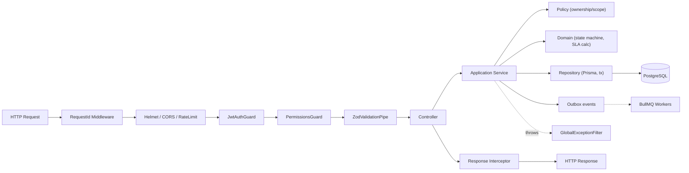

# OpsDesk — Technical Requirements Document (TRD)

| Field | Value |
|---|---|
| Document | Technical Requirements Document |
| Version | 1.0 |
| Status | Draft for build |
| Related | [PRD](./01-PRD.md) · [UI/UX](./03-UI-UX-Design.md) · [App Flow](./04-App-Flow.md) · [Backend Schema](./05-Backend-Schema.md) · [Implementation Plan](./06-Implementation-Plan.md) |

---

## 1. Purpose

Defines **how** OpsDesk is built: stack, architecture, module boundaries, API contracts, authorization model, state machines, SLA engine, background processing, security, error handling, testing, and quality gates. Requirement IDs (e.g. `TKT-4`) refer to the [PRD](./01-PRD.md).

---

## 2. Technology Stack

| Layer | Choice | Rationale |
|---|---|---|
| Language | TypeScript 5.x (`strict: true`) everywhere | One language, shared types |
| Monorepo | pnpm workspaces + Turborepo | Shared packages, cached tasks |
| Frontend | Next.js 15 (App Router), React 19 | Routing, layouts, server components for shells |
| Styling | Tailwind CSS 4 + shadcn/ui (Radix primitives) | Accessible primitives, owned components |
| Server state | TanStack Query v5 | Caching, invalidation, optimistic updates |
| Client state | React state + URL search params (nuqs); Zustand only if needed | Avoid global-store sprawl |
| Forms | React Hook Form + Zod (`@hookform/resolvers`) | Shared schemas with backend |
| Tables | TanStack Table v8 (server-side mode) | Headless, accessible |
| Charts | Recharts | Simple operational charts |
| Backend | NestJS 11 (Express adapter) | Modules, DI, guards, pipes |
| Validation (API) | Zod via `nestjs-zod` (schemas in `packages/contracts`) | Single source of truth FE/BE |
| ORM | Prisma 6 | Typed client, migrations |
| Database | PostgreSQL 16 | Constraints, partial indexes, FTS, `pg_trgm` |
| Queue / jobs | BullMQ on Redis 7 | Repeatable jobs, retries, backoff |
| Auth | Custom: argon2id + JWT access token (15 min) + rotating opaque refresh token (DB-stored, hashed) in HttpOnly cookies | Full control, revocable sessions |
| Files | Storage interface; local disk (dev) / S3-compatible (later) | Swappable |
| Email | Nodemailer + React Email templates; Mailpit in dev | Testable |
| API docs | OpenAPI generated from Zod (`@nestjs/swagger` + `nestjs-zod`) at `/api/docs` | Contract visibility |
| Logging | Pino (`nestjs-pino`), JSON, request id | Structured |
| Testing | Vitest (unit), Jest-compatible Nest testing + Supertest + Testcontainers (integration), Playwright (e2e), Testing Library (components) | Behavior-focused |
| Lint/format | ESLint (typescript-eslint strict), Prettier | Consistency |
| Local infra | Docker Compose for Postgres, Redis, Mailpit only | Dev convenience (not a deployment target) |

---

## 3. Repository Layout

```text
opsdesk/
├── apps/
│   ├── web/                    # Next.js frontend
│   │   ├── src/app/            # Routes (App Router)
│   │   │   ├── (auth)/login, forgot-password, reset-password, accept-invite
│   │   │   └── (app)/dashboard, tickets, assets, incidents, changes, ...
│   │   ├── src/components/ui/  # shadcn primitives
│   │   ├── src/components/     # shared composites (DataTable, StatusBadge, SlaTimer...)
│   │   ├── src/features/<module>/  # api.ts, hooks.ts, components/, forms/
│   │   └── src/lib/            # api client, auth, permissions, formatting
│   └── api/                    # NestJS backend
│       ├── src/main.ts
│       ├── src/common/         # filters, interceptors, guards, decorators, pagination
│       ├── src/infra/          # prisma, redis, queue, storage, mail
│       ├── src/modules/<module>/
│       │   ├── <module>.module.ts
│       │   ├── <module>.controller.ts     # thin: parse → call service → map
│       │   ├── <module>.service.ts        # application service (use cases, tx)
│       │   ├── <module>.repository.ts     # Prisma queries
│       │   ├── domain/                    # pure logic: state machine, policies, calculators
│       │   ├── <module>.policy.ts         # authorization rules for the resource
│       │   └── jobs/                      # BullMQ processors
│       ├── prisma/schema.prisma, migrations/, seed.ts
│       └── test/               # integration tests
├── packages/
│   ├── contracts/              # Zod schemas, DTO types, enums, error codes, permission keys
│   ├── config/                 # eslint, tsconfig, tailwind presets
│   └── ui-tokens/              # design tokens (optional)
├── e2e/                        # Playwright
├── docs/                       # this folder
└── docker-compose.yml          # postgres, redis, mailpit
```

**Rule:** domain logic (`domain/`) has no Nest or Prisma imports and is unit-tested in isolation. Controllers contain no business logic. React components contain no business rules—only presentation logic driven by API data and `can()` checks.

---

## 4. Backend Architecture

### 4.1 Request pipeline



### 4.2 Modules

| Module | Responsibility | Phase |
|---|---|---|
| `AuthModule` | login, logout, refresh, password reset, invitation acceptance, sessions | MVP |
| `UsersModule` | user profile, admin user management, status changes | MVP |
| `AccessModule` (Roles + Permissions) | role/permission catalog, `PermissionService`, guards | MVP |
| `OrgModule` (Departments + Teams) | departments, teams, memberships | MVP |
| `CatalogModule` | ticket categories/subcategories, asset types, resolution codes | MVP |
| `TicketsModule` | tickets, state machine, assignment, history | MVP |
| `CommentsModule` | public comments, internal notes | MVP |
| `AttachmentsModule` | upload, scan/validate, download, storage interface | MVP |
| `SlaModule` | policies, calendars, calculator, timers, evaluator job | MVP |
| `AssetsModule` | assets, assignments, history, state machine | MVP |
| `NotificationsModule` | notification creation, delivery, read state, preferences | MVP |
| `AuditModule` | audit writer, search | MVP |
| `DashboardModule` | role-aware aggregates | MVP |
| `SearchModule` | global search | MVP |
| `IncidentsModule` | incidents, timeline, ticket links, postmortem | P2 |
| `ChangesModule` + `ApprovalsModule` | change requests, approval rules, decisions | P2 |
| `WorkflowsModule` | onboarding/offboarding requests, templates, tasks | P2 |
| `KnowledgeModule` | articles, lifecycle, FTS | P2 |
| `ReportsModule` | report queries, CSV export | P2 |
| `SettingsModule` | org settings (timezone, reopen window, upload limits) | MVP |

Modules communicate via exported services (synchronous) or domain events (asynchronous). Circular imports are forbidden; use events instead.

### 4.3 Domain events & outbox

Business writes that require side-effects (notifications, emails, SLA recompute) insert an `OutboxEvent` row **in the same transaction**. A dispatcher job polls the outbox (every 2 s, `FOR UPDATE SKIP LOCKED`), publishes to BullMQ queues, and marks rows processed. This guarantees no notification is sent for a rolled-back write and no event is lost on crash.

Event examples: `ticket.created`, `ticket.assigned`, `ticket.status_changed`, `ticket.comment_added`, `sla.warning`, `sla.escalated`, `sla.breached`, `asset.assigned`, `incident.declared`, `change.submitted`, `change.decided`, `workflow.task_assigned`.

### 4.4 Transactions

All multi-row use cases run inside `prisma.$transaction(async (tx) => ...)` with isolation `READ COMMITTED` plus explicit locking where needed. Examples:

| Use case | Writes in one transaction |
|---|---|
| Create ticket | ticket + SLA timers + history(CREATED) + audit + outbox(`ticket.created`) |
| Assign ticket | ticket(update with version check) + history(ASSIGNED) + audit + outbox |
| Change status | ticket + history + SLA pause/resume/complete + SlaEvent + audit + outbox |
| Assign asset | close prior assignment + new assignment + asset status + asset history + audit |
| Record approval | approval row + change status (if threshold met) + change history + audit + outbox |

### 4.5 Concurrency control

- **Optimistic locking**: `Ticket`, `Asset`, `Incident`, `ChangeRequest`, `WorkflowTask` have `version Int`. Mutations require the client's `version`; repository uses `updateMany({ where: { id, version }, data: { ..., version: { increment: 1 } } })`. `count === 0` → `409 CONFLICT_STALE_VERSION` with the current record so the UI can show "This ticket was updated by Sara. Review changes."
- **DB constraints as last line**: partial unique index for active asset assignment; unique approval per (change, approver, round).
- **Row locks** for counters/sequence-like logic (`SELECT ... FOR UPDATE`) when needed; ticket keys use a Postgres `SEQUENCE`.
- **Idempotency**: `POST` create endpoints accept an optional `Idempotency-Key` header (stored 24 h) to prevent duplicate submissions on retry.

---

## 5. Authorization Model

### 5.1 Layers

1. **Authentication** — `JwtAuthGuard` validates the access token cookie, loads `AuthUser { id, roles, permissions[], teamIds[], departmentId, status }` (cached in Redis 60 s, busted on role/status change).
2. **Permission** — `@RequirePermissions('ticket:assign')` + `PermissionsGuard`. Coarse gate.
3. **Policy (ownership + scope)** — resource policy classes in each module, invoked by services after loading the resource:

```ts
// tickets.policy.ts (illustrative)
canView(user, t) =
  has(user,'ticket:view_all')
  || t.requesterId === user.id
  || (has(user,'ticket:view_team') && user.teamIds.includes(t.teamId))
  || t.assigneeId === user.id
  || t.watchers.includes(user.id);
```

4. **Query scoping** — list endpoints apply a `where` scope built from the same policy (`ticketScope(user)`), so unauthorized rows are never fetched. Pagination counts are computed on the scoped query.
5. **Field-level** — internal notes and SLA internals filtered by `ticket:view_internal`.

Unauthorized access to a specific resource returns **404** (not 403) when the user can't know it exists; 403 when the resource is visible but the action is forbidden.

### 5.2 Permission catalogue (MVP + P2)

```text
ticket:create ticket:view ticket:view_team ticket:view_all ticket:view_internal
ticket:update ticket:triage ticket:assign ticket:reassign ticket:resolve ticket:reopen
ticket:close ticket:cancel ticket:delete ticket:comment_internal ticket:admin_override
attachment:upload attachment:delete
asset:view asset:view_all asset:create asset:update asset:assign asset:retire asset:dispose
category:manage asset_type:manage sla:manage
incident:create incident:view incident:manage incident:close postmortem:manage
change:create change:view change:update change:approve change:implement
workflow:create workflow:view workflow:manage
kb:view kb:create kb:publish
user:view user:create user:update user:disable role:manage
team:manage department:manage
audit:view reports:view settings:manage
```

### 5.3 Default role mapping (abridged)

| Permission group | EMPLOYEE | AGENT | MANAGER | ADMIN |
|---|:-:|:-:|:-:|:-:|
| `ticket:create`, `ticket:view` (own) | ✅ | ✅ | ✅ | ✅ |
| `ticket:view_team`, `view_internal`, `triage`, `assign`, `resolve`, `comment_internal` | – | ✅ | ✅ | ✅ |
| `ticket:view_all`, `reassign`, `cancel` (any) | – | – | ✅ | ✅ |
| `ticket:reopen` | own, within window | ✅ | ✅ | ✅ |
| `ticket:admin_override`, `ticket:delete` | – | – | – | ✅ |
| `asset:view` (own) | ✅ | ✅ | ✅ | ✅ |
| `asset:view_all`, `asset:assign`, `asset:update` | – | ✅ | ✅ | ✅ |
| `asset:create`, `asset:retire`, `asset:dispose` | – | – | ✅ | ✅ |
| `incident:create`, `incident:view` | – | ✅ | ✅ | ✅ |
| `incident:manage`, `incident:close`, `postmortem:manage` | – | – | ✅ | ✅ |
| `change:create`, `change:view`, `change:implement` | – | ✅ | ✅ | ✅ |
| `change:approve` | – | – | ✅ | ✅ |
| `kb:view` (published) | ✅ | ✅ | ✅ | ✅ |
| `kb:create` / `kb:publish` | – | ✅ / – | ✅ / ✅ | ✅ / ✅ |
| `user:view` | – | ✅ (directory) | ✅ | ✅ |
| `user:create/update/disable`, `role:manage`, `team:manage`, `department:manage`, `category:manage`, `sla:manage`, `settings:manage` | – | – | – | ✅ |
| `audit:view` | – | – | ✅ (scoped) | ✅ |
| `reports:view` | – | – | ✅ | ✅ |

Manager scope: `ticket:view_all` is limited to teams they manage unless they also hold `ADMIN`. Implemented as scope in policy, not a separate permission.

---

## 6. Domain State Machines

State machines are pure modules: `canTransition(from, to, ctx)` returns `{ ok: true } | { ok: false, code }`, plus side-effect descriptors (`pauseSla`, `completeResponseTimer`, ...). Services apply side effects.

### 6.1 Ticket

| From | To | Required permission | Guards / side effects |
|---|---|---|---|
| `NEW` | `TRIAGED` | `ticket:triage` | category + priority set |
| `NEW`,`TRIAGED` | `ASSIGNED` | `ticket:assign` | team set; assignee ∈ team members |
| `ASSIGNED` | `IN_PROGRESS` | assignee or `ticket:reassign` | — |
| `IN_PROGRESS`,`ESCALATED`,`REOPENED` | `WAITING_FOR_USER` | assignee | requires public comment; **pause resolution SLA** if policy says so |
| `WAITING_FOR_USER` | `IN_PROGRESS` | assignee, or auto on requester comment | **resume SLA** |
| `IN_PROGRESS` | `ESCALATED` | assignee/`ticket:reassign` | reason required; notify manager |
| `ESCALATED` | `IN_PROGRESS` | `ticket:reassign` | — |
| `IN_PROGRESS`,`ESCALATED` | `RESOLVED` | `ticket:resolve` | resolution summary + code required; **complete resolution SLA** |
| `RESOLVED` | `CLOSED` | requester, or system after reopen window, or `ticket:close` | — |
| `RESOLVED` | `REOPENED` | requester (within window) or `ticket:reopen` | reason required; **restart resolution timer** (new timer, breach state preserved on old) |
| `REOPENED` | `IN_PROGRESS` | assignee | — |
| `NEW`,`TRIAGED`,`ASSIGNED` | `CANCELLED` | requester (own, `NEW` only) or `ticket:cancel` | reason required; **stop SLA** |

`CLOSED` and `CANCELLED` are terminal. Any other request → `422 TICKET_INVALID_TRANSITION`. First staff public comment sets `firstResponseAt` and completes the response timer regardless of status.

### 6.2 Asset

| From | To | Guards |
|---|---|---|
| `PROCURED` | `IN_STOCK` | received date |
| `IN_STOCK` | `ASSIGNED` | assignee active user; creates assignment |
| `ASSIGNED` | `IN_STOCK` | closes assignment (return) |
| `ASSIGNED` | `ASSIGNED` | reassignment: closes old, opens new |
| `IN_STOCK`,`ASSIGNED` | `IN_REPAIR` | repair note; assignment **kept** (flag `inRepair`) or closed per option |
| `IN_REPAIR` | `IN_STOCK`/`ASSIGNED` | repair outcome note |
| `IN_STOCK`,`ASSIGNED`,`IN_REPAIR` | `LOST` | closes assignment; reason |
| `LOST` | `IN_STOCK` | found note |
| `IN_STOCK`,`IN_REPAIR`,`LOST` | `RETIRED` | `asset:retire`; no active assignment |
| `RETIRED` | `DISPOSED` | `asset:dispose`; disposal method; terminal |

DB check: `status IN ('RETIRED','DISPOSED','LOST')` ⇒ no active assignment (enforced by service + trigger `asset_assignment_status_guard`).

### 6.3 Incident (P2)

`IDENTIFIED → INVESTIGATING → MITIGATING → MONITORING → RESOLVED → CLOSED`; `IDENTIFIED|INVESTIGATING → ESCALATED → INVESTIGATING`; `MONITORING → INVESTIGATING` (regression). `RESOLVED` requires root cause, impact, mitigation. `CLOSED` requires `incident:close` and (for SEV1/SEV2) a published postmortem.

### 6.4 Change (P2)

| From | To | Guard |
|---|---|---|
| `DRAFT` | `SUBMITTED` | requester; all plans filled; schedule in future (except emergency) |
| `SUBMITTED` | `UNDER_REVIEW` | auto when first approver opens/assigned |
| `UNDER_REVIEW` | `APPROVED` | auto when approvals ≥ required by rule and no REJECTED |
| `UNDER_REVIEW` | `REJECTED` | any REJECTED decision (terminal) |
| `UNDER_REVIEW` | `DRAFT` | any REQUEST_CHANGES (new approval round on resubmit) |
| `SUBMITTED` (STANDARD) | `APPROVED` | auto (pre-approved) |
| `APPROVED` | `SCHEDULED` | owner confirms window |
| `SCHEDULED` | `IMPLEMENTING` | `change:implement`; now ≥ start − 15 min |
| `IMPLEMENTING` | `VALIDATING` | — |
| `VALIDATING` | `COMPLETED` | validation notes |
| `IMPLEMENTING`,`VALIDATING` | `FAILED` | failure notes |
| `FAILED` | `ROLLED_BACK` | rollback notes |
| `ROLLED_BACK`,`COMPLETED` | `CLOSED` | — |
| `DRAFT`..`SCHEDULED` | `CANCELLED` | requester/owner |

Approval rule table (`ChangeApprovalRule`): `(type, risk) → requiredApprovals, approverRole`. Defaults: STANDARD → 0; NORMAL LOW/MEDIUM → 1 MANAGER; NORMAL HIGH → 2 MANAGER; NORMAL CRITICAL → 2 MANAGER + 1 ADMIN; EMERGENCY → 1 MANAGER (post-implementation review task created).

### 6.5 Workflow task (P2)

`PENDING → IN_PROGRESS → COMPLETED`; `PENDING|IN_PROGRESS → BLOCKED → IN_PROGRESS`; `PENDING|IN_PROGRESS → SKIPPED` (reason; non-required only, or `workflow:manage`). Request status derived: `OPEN` until all required tasks terminal → `COMPLETED`.

---

## 7. SLA Engine

### 7.1 Policy selection (`SLA-2`)

Candidate policies: `isActive = true` and matching `priority`; optional `ticketType` and `categoryId` filters (`NULL` = wildcard). Score = (+4 category match) + (+2 type match) + (+1 priority match). Highest score wins; tie → lowest `sortOrder`. No match → org default policy. Selection is a pure function with table-driven tests.

### 7.2 Calculator (pure)

```ts
addBusinessMinutes(start: Instant, minutes: number, cal: Calendar): Instant
businessMinutesBetween(a: Instant, b: Instant, cal: Calendar): number
```

- Calendar: `timezone`, weekly schedule (per weekday start/end, may be closed), holidays (dates). `24x7` calendar is a special case.
- Uses `@js-joda/core` / `Temporal` polyfill for timezone-correct arithmetic (DST-safe).
- Due time = `addBusinessMinutes(startedAt, target, cal)` then shifted by accumulated paused minutes.

### 7.3 Timer model

Per ticket: up to two active `SlaTimer` rows (`RESPONSE`, `RESOLUTION`) with fields `startedAt, dueAt, pausedAt, pausedMinutes, completedAt, breachedAt, warnedAt, escalatedAt, state`.

- **Pause**: set `pausedAt`, `state=PAUSED`.
- **Resume**: `pausedMinutes += businessMinutesBetween(pausedAt, now)`, recompute `dueAt`, clear `pausedAt`, state recomputed.
- **Recalculate** (priority/type/category change): new policy → recompute `dueAt` from original `startedAt` with new targets; record `RECALCULATED` event with old/new due.
- **Percent consumed** = `businessMinutesBetween(startedAt, now) − pausedMinutes` ÷ target.
- **State**: `COMPLETED` if completedAt; `PAUSED` if pausedAt; `BREACHED` if now > dueAt; `AT_RISK` if ≥ warningPct; else `ON_TRACK`. Breach is sticky (a completed-late timer keeps `breachedAt`).

### 7.4 Evaluator job (`SLA-6`)

- BullMQ repeatable job `sla.evaluate` every 60 s.
- Query: active timers where `completedAt IS NULL AND pausedAt IS NULL AND (warnedAt IS NULL OR escalatedAt IS NULL OR breachedAt IS NULL)` and threshold crossed — computed by comparing precomputed `warnAt`, `escalateAt`, `dueAt` columns (stored on recalculation) against `now()`; indexed.
- For each crossed threshold: in a transaction set the timestamp **only if still NULL** (`updateMany where warnedAt IS NULL`) → guarantees once-only, then insert `SlaEvent` + outbox event.
- Batches of 500; job is idempotent and safe to run concurrently.

---

## 8. Background Jobs

| Queue | Job | Schedule / trigger | Retry |
|---|---|---|---|
| `outbox` | `dispatch` | every 2 s | n/a (re-polled) |
| `sla` | `evaluate` | every 60 s | 3, exp backoff |
| `notifications` | `fanout` (event → recipients → `Notification` rows) | on event | 5 |
| `email` | `send` | on event (if preference allows) | 5, exp backoff, DLQ |
| `tickets` | `autoClose` resolved tickets past reopen window | hourly | 3 |
| `maintenance` | purge expired reset tokens, idempotency keys, refresh tokens; orphan upload cleanup | daily 03:00 | 3 |
| `reports` (P2) | precompute daily aggregates `DailyTicketStats` | daily 00:15 | 3 |
| `assets` | warranty-expiring notifications (30 days) | daily 08:00 | 3 |

Workers run in a separate process (`apps/api/src/worker.ts`) sharing modules; the API process does not execute jobs.

---

## 9. Audit Logging

- `AuditService.record(tx, { action, entityType, entityId, before, after, metadata })` called inside the use-case transaction; `actorId`, `requestId`, `ip`, `userAgent` come from `AsyncLocalStorage` request context.
- `before`/`after` store **only changed fields**; a redaction list removes `passwordHash`, tokens, secrets.
- DB: app role has `INSERT, SELECT` only on `audit_logs`; a trigger raises on `UPDATE/DELETE`.

**Catalogue (MVP):** `auth.login_succeeded`, `auth.login_failed`, `auth.logout`, `auth.password_reset_requested`, `auth.password_reset_completed`, `user.invited`, `user.activated`, `user.updated`, `user.status_changed`, `user.roles_changed`, `role.permissions_changed`, `team.*`, `department.*`, `ticket.created`, `ticket.status_changed`, `ticket.priority_changed`, `ticket.assigned`, `ticket.reassigned`, `ticket.resolved`, `ticket.reopened`, `ticket.closed`, `ticket.cancelled`, `ticket.admin_override`, `attachment.uploaded`, `attachment.deleted`, `sla_policy.*`, `sla.breached`, `asset.created`, `asset.updated`, `asset.assigned`, `asset.unassigned`, `asset.status_changed`, `category.*`, `settings.updated`. **P2:** `incident.*`, `change.*`, `change.approval_recorded`, `workflow.*`, `kb.published`.

---

## 10. API Design

### 10.1 Conventions

- Base path `/api/v1`. JSON only (except uploads: `multipart/form-data`; downloads: stream).
- Resource nouns, plural; sub-resources for owned collections; **state transitions are explicit action endpoints** (`POST /tickets/:id/transitions`) rather than `PATCH status`.
- `GET` list → `200 { data: T[], meta: { page, pageSize, total, totalPages } }`. Offset pagination (`page`, `pageSize ≤ 100`). Audit log and notifications use cursor pagination (`cursor`, `limit`) → `meta: { nextCursor }`.
- Sorting: `sort=-createdAt,priority` (allow-listed fields per resource).
- Filtering: `status=NEW,TRIAGED&priority=HIGH&createdFrom=...&createdTo=...` (allow-listed, typed via Zod).
- Search: `q=` (trigram/FTS).
- `GET` detail → `200 { data: T }`. Create → `201` + `Location`. Action → `200 { data: T }`. Delete → `204`.
- Concurrency: mutations carry `version` in body; stale → `409`.
- Dates ISO-8601 UTC. IDs: UUIDv7 (`id`) + human key (`key`, e.g. `TKT-004821`, `LAP-00421`, `INC-2026-001`, `CHG-000123`). Path params accept either.

### 10.2 Error format (`PRD §75`)

```json
{
  "statusCode": 422,
  "code": "TICKET_INVALID_TRANSITION",
  "message": "Ticket cannot move from CLOSED to IN_PROGRESS.",
  "details": [{ "field": "status", "issue": "not_allowed" }],
  "requestId": "req_01J9Z3K..."
}
```

| HTTP | When | Example codes |
|---|---|---|
| 400 | Malformed / Zod validation | `VALIDATION_FAILED` |
| 401 | Not authenticated / expired | `AUTH_REQUIRED`, `AUTH_TOKEN_EXPIRED`, `AUTH_INVALID_CREDENTIALS` |
| 403 | Authenticated, forbidden action | `FORBIDDEN`, `ACCOUNT_NOT_ACTIVE` |
| 404 | Not found or not visible | `TICKET_NOT_FOUND`, `ASSET_NOT_FOUND` |
| 409 | Conflict | `CONFLICT_STALE_VERSION`, `ASSET_ALREADY_ASSIGNED`, `EMAIL_TAKEN` |
| 413 | Upload too large | `ATTACHMENT_TOO_LARGE` |
| 415 | Bad file type | `ATTACHMENT_TYPE_NOT_ALLOWED` |
| 422 | Business rule violated | `TICKET_INVALID_TRANSITION`, `ASSIGNEE_NOT_IN_TEAM`, `CHANGE_NOT_APPROVED`, `SELF_APPROVAL_FORBIDDEN` |
| 429 | Rate limited | `RATE_LIMITED` |
| 500 | Unexpected | `INTERNAL_ERROR` (no stack, requestId only) |

Domain errors are typed classes (`DomainError(code, httpStatus, message, details)`) mapped by `GlobalExceptionFilter`. Prisma `P2002` → 409, `P2025` → 404. Error codes are exported from `packages/contracts` so the frontend can switch on them.

### 10.3 Endpoint catalogue

**Auth**
```
POST   /auth/login                       {email,password} → sets cookies, returns me
POST   /auth/logout
POST   /auth/refresh                     rotates refresh token
POST   /auth/password/forgot             {email} → 202 always
POST   /auth/password/reset              {token,newPassword}
POST   /auth/invitations/accept          {token,password}
GET    /auth/me                          user + permissions + teams
GET    /auth/sessions | DELETE /auth/sessions/:id
```

**Users / Org / Access**
```
GET    /users                 ?q,status,role,departmentId,teamId,page,sort
POST   /users                 (invite)
GET    /users/:id
PATCH  /users/:id
POST   /users/:id/status      {status, reason}
PUT    /users/:id/roles       {roleIds}
GET|PATCH /users/me           profile
GET|POST /departments  ·  GET|PATCH|DELETE /departments/:id
GET|POST /teams        ·  GET|PATCH|DELETE /teams/:id
PUT    /teams/:id/members     {userIds, leadId}
GET    /roles  ·  GET /roles/:id  ·  PUT /roles/:id/permissions   (P3 custom roles)
GET    /permissions
```

**Catalog**
```
GET|POST /categories  ·  PATCH|DELETE /categories/:id   (tree; ?includeInactive)
GET|POST /asset-types ·  PATCH|DELETE /asset-types/:id
GET|POST /resolution-codes
```

**Tickets**
```
GET    /tickets               ?q,status,priority,type,categoryId,teamId,assigneeId,requesterId,
                               departmentId,assetId,slaState,createdFrom,createdTo,updatedFrom,updatedTo,
                               view=mine|team|unassigned|all, page,pageSize,sort
POST   /tickets
GET    /tickets/:id           includes sla timers, asset summary, permissions {can: {...}}
PATCH  /tickets/:id           {version, title?, description?, priority?, type?, categoryId?, subcategoryId?, assetId?}
POST   /tickets/:id/transitions   {version, to, reason?, resolution?: {code, summary}}
POST   /tickets/:id/assignment    {version, teamId, assigneeId|null}
GET    /tickets/:id/allowed-transitions
GET    /tickets/:id/comments      ?includeInternal (ignored unless permitted)
POST   /tickets/:id/comments      {body, visibility: PUBLIC|INTERNAL}
PATCH  /tickets/:id/comments/:cid (author, 15-min edit window, history kept)
GET    /tickets/:id/attachments
POST   /tickets/:id/attachments   multipart
GET    /attachments/:aid/download (authorized stream; Content-Disposition: attachment)
DELETE /attachments/:aid
GET    /tickets/:id/history       ?cursor
GET    /tickets/:id/sla
POST   /tickets/:id/watchers  ·  DELETE /tickets/:id/watchers/:userId
POST   /tickets/:id/incident      {incidentId}        (P2)
POST   /tickets/:id/articles      {articleId}         (P2)
```

**SLA**
```
GET|POST /sla-policies  ·  GET|PATCH|DELETE /sla-policies/:id
GET|POST /business-calendars  ·  PATCH /business-calendars/:id
POST   /sla-policies/preview      {priority,type,categoryId,createdAt} → selected policy + due times
```

**Assets**
```
GET    /assets                ?q,typeId,status,departmentId,assignedUserId,warranty=active|expiring|expired,location
POST   /assets
GET    /assets/:id
PATCH  /assets/:id            {version, ...}
POST   /assets/:id/assign     {version, userId, note}
POST   /assets/:id/unassign   {version, note, condition}
POST   /assets/:id/transitions {version, to, note, disposalMethod?}
GET    /assets/:id/history
GET    /assets/:id/assignments
GET    /assets/:id/tickets
GET    /users/me/assets
```

**Notifications**
```
GET    /notifications         ?unread=true&cursor
GET    /notifications/unread-count
POST   /notifications/:id/read
POST   /notifications/read-all
GET|PUT /notifications/preferences          (P2)
```

**Audit / Dashboard / Search / Settings**
```
GET    /audit-logs            ?actorId,action,entityType,entityId,from,to,cursor
GET    /dashboard/employee | /dashboard/agent | /dashboard/manager | /dashboard/admin
GET    /search                ?q&types=ticket,asset,user,incident  (top 5 each, scoped)
GET|PATCH /settings
GET    /health
```

**Phase 2**
```
Incidents:  GET|POST /incidents · GET|PATCH /incidents/:id · POST /incidents/:id/transitions
            GET|POST /incidents/:id/timeline · GET|POST|DELETE /incidents/:id/tickets
            POST /incidents/:id/notify-requesters
            GET|PUT /incidents/:id/postmortem · POST /incidents/:id/postmortem/publish
            GET|POST|PATCH /incidents/:id/postmortem/actions
Changes:    GET|POST /changes · GET|PATCH /changes/:id · POST /changes/:id/submit
            POST /changes/:id/transitions · GET /changes/:id/approvals
            POST /changes/:id/approvals {decision, comment} · GET /changes/:id/history
            GET /changes/calendar?from&to · GET|PUT /change-approval-rules
Workflows:  GET|POST /onboarding · GET /onboarding/:id · GET|POST /offboarding · GET /offboarding/:id
            PATCH /workflow-tasks/:id · POST /workflow-tasks/:id/transitions
            GET|POST|PATCH /workflow-templates
Knowledge:  GET|POST /kb/articles · GET|PATCH /kb/articles/:id · POST /kb/articles/:id/transitions
            GET /kb/suggest?q&categoryId
Reports:    GET /reports/:reportKey?from&to&groupBy&format=json|csv
```

---

## 11. Frontend Architecture

### 11.1 Layers

| Layer | Location | Responsibility |
|---|---|---|
| Routes / pages | `app/(app)/**/page.tsx` | Compose features, read URL params |
| Feature API | `features/<m>/api.ts` | Typed fetchers using `packages/contracts` types |
| Feature hooks | `features/<m>/hooks.ts` | `useTickets(filters)`, `useTransitionTicket()` — TanStack Query |
| Forms | `features/<m>/forms/*` | RHF + shared Zod schemas |
| Composites | `components/*` | `DataTable`, `FilterBar`, `StatusBadge`, `PriorityBadge`, `SlaTimer`, `Timeline`, `EmptyState`, `ConfirmDialog` |
| Primitives | `components/ui/*` | shadcn/Radix |
| Lib | `lib/*` | `apiClient` (fetch wrapper, refresh-on-401, error normalization), `can(permission)`, date formatting |

### 11.2 Data fetching rules

- Query keys: `['tickets', 'list', filters]`, `['tickets', 'detail', id]`, etc. Mutations invalidate precisely.
- Optimistic updates only for low-risk actions (mark notification read, watchers). Transitions/assignment wait for server.
- `409` → show conflict banner with "Reload" (and diff when available).
- Polling: notification unread count every 30 s; ticket detail `refetchOnWindowFocus`. (SSE/WebSocket is a later enhancement.)

### 11.3 Auth on the client

- Cookies only (no tokens in JS). `middleware.ts` redirects unauthenticated users to `/login` (presence check only).
- `AuthProvider` loads `/auth/me`; `can()` uses returned permissions for UI gating. **Backend remains authoritative.**
- Detail endpoints return `permissions.can` booleans per action (e.g. `{ assign, resolve, reopen, comment_internal }`) so the UI never re-implements policy logic.

---

## 12. Security Requirements

| Area | Implementation |
|---|---|
| Passwords | argon2id (m=19 MiB, t=2, p=1); min 12 chars; breached-password check optional (k-anon HIBP) |
| Tokens | Access JWT 15 min (HS256, rotated secret via env); refresh token 7 days, opaque random 256-bit, stored **hashed**; rotation with reuse detection (reuse → revoke family) |
| Cookies | `HttpOnly; Secure; SameSite=Lax; Path=/`; refresh cookie `Path=/api/v1/auth` |
| CSRF | SameSite + double-submit token header `X-CSRF-Token` on mutating requests |
| Rate limiting | `@nestjs/throttler` w/ Redis: login 5/min/IP+email, forgot 3/hour/email, global 300/min/user |
| Account lockout | 10 failed logins → 15 min lock, audited |
| Input validation | Zod on every body/query/param; reject unknown keys (`strict()`) |
| Output | React escaping; Markdown (KB/comments) rendered with sanitization (`rehype-sanitize`); no `dangerouslySetInnerHTML` without sanitizer |
| Headers | Helmet: CSP (self + nonce), HSTS, X-Content-Type-Options, frame-ancestors none, Referrer-Policy |
| CORS | Allow-list frontend origin, credentials true |
| Uploads | size limit at proxy + Multer; MIME allow-list + magic-byte sniffing (`file-type`); random storage key (UUID), original name sanitized and stored separately; served via authorized endpoint with `Content-Disposition: attachment` and `X-Content-Type-Options: nosniff`; SVG/HTML disallowed; optional ClamAV hook interface |
| Access control | Policy layer + query scoping; 404 for invisible resources |
| Secrets | `.env` (not committed), validated at boot with Zod; no secrets in logs |
| Logging | PII minimized; tokens/passwords redacted by Pino redaction paths |
| DB | App role least-privileged; audit table insert-only; parameterized queries only (Prisma; raw SQL via `Prisma.sql`) |
| Dependencies | `pnpm audit` in local quality gate |

---

## 13. Performance & Data Access

- Every list filter column used in `WHERE` has an index (see [Backend Schema §7](./05-Backend-Schema.md#7-indexes)).
- Ticket search: `pg_trgm` GIN on `title`, FTS `tsvector` (generated column) on `title || description`; key lookup exact.
- Dashboards use `COUNT ... FILTER (WHERE ...)` aggregate queries; manager reports from `DailyTicketStats` (P2).
- Avoid N+1: repositories use `select`/`include` explicitly; list DTOs are slim.
- Response compression (gzip) and `ETag` on GET detail.

---

## 14. Testing Strategy

| Level | Tooling | Scope | Gate |
|---|---|---|---|
| Unit | Vitest | `domain/*`: state machines (exhaustive from×to table), SLA calculator (DST, holidays, pauses, boundaries), policy selection, permission evaluation, approval threshold logic | ≥ 90% lines on `domain/` |
| Integration | Nest testing + Supertest + Testcontainers Postgres/Redis | Each endpoint: happy path, validation, 401, 403/404 per role, business-rule violations, concurrency (parallel requests), audit row written, outbox row written | All endpoints covered |
| Component | Testing Library + Vitest | Forms validation & error display, `SlaTimer`, `StatusBadge`, permission gating | Key components |
| E2E | Playwright (seeded DB) | Flows in [App Flow §8](./04-App-Flow.md): ticket lifecycle, SLA pause, asset assign/repair, attachment access, change approval (P2), incident linking (P2) | All primary flows green |
| Accessibility | `@axe-core/playwright` | Every primary page | 0 serious/critical |

Critical behavior tests (must exist): unauthorized access per role, invalid transitions, SLA calc & breach, duplicate/concurrent assignment, approval permissions & self-approval, ticket visibility incl. internal notes, attachment download authorization, reopen window, audit immutability.

Test data: `prisma/seed.ts` creates org, departments, teams, 4 role users (`employee@`, `agent@`, `manager@`, `admin@opsdesk.local`), categories, SLA policies, calendar, assets, sample tickets.

---

## 15. Configuration

`.env` validated at boot:

```
DATABASE_URL, REDIS_URL, APP_URL, API_URL,
JWT_ACCESS_SECRET, JWT_ACCESS_TTL=900, REFRESH_TTL_DAYS=7,
CSRF_SECRET, SMTP_HOST, SMTP_PORT, SMTP_FROM,
STORAGE_DRIVER=local|s3, STORAGE_LOCAL_PATH, S3_*,
UPLOAD_MAX_BYTES=10485760, UPLOAD_MAX_PER_TICKET=10,
ORG_TIMEZONE=Asia/Karachi, LOG_LEVEL=info
```

Runtime org settings (DB, `settings:manage`): reopen window days, auto-close enabled, default SLA policy, default calendar, allowed upload types, password policy.

---

## 16. Quality Gates (local)

`pnpm verify` = `typecheck` → `lint` → `test:unit` → `test:integration` → `build`. E2E via `pnpm test:e2e`. A feature PR is mergeable only when the gate is green and the [Definition of Done](./01-PRD.md#14-definition-of-done-per-feature) is satisfied. (CI/CD pipelines are out of scope for now.)

---

## 17. Architecture Decision Records

ADRs live in `docs/adr/NNNN-title.md` (use the `architecture-decision-records` skill). Initial decisions to record:

1. ADR-0001 Monorepo with shared Zod contracts.
2. ADR-0002 Custom cookie-based JWT + rotating refresh tokens (vs. NextAuth).
3. ADR-0003 Explicit transition endpoints + pure state machines.
4. ADR-0004 Transactional outbox + BullMQ for side effects.
5. ADR-0005 Optimistic locking with `version` column.
6. ADR-0006 SLA timers as rows with precomputed thresholds.
7. ADR-0007 Offset pagination for tables, cursor for feeds.
