# OpsDesk — Application Flow

| Field | Value |
|---|---|
| Document | App Flow (user journeys, routes, system sequences) |
| Version | 1.0 |
| Related | [PRD](./01-PRD.md) · [TRD](./02-TRD.md) · [UI/UX](./03-UI-UX-Design.md) · [Backend Schema](./05-Backend-Schema.md) |

---

## 1. Route Map & Access

| Route | Purpose | Required (UI gate) | Phase |
|---|---|---|---|
| `/login` | Sign in | public | MVP |
| `/forgot-password`, `/reset-password?token=` | Password reset | public | MVP |
| `/accept-invite?token=` | Activate invited account | public | MVP |
| `/dashboard` | Role-aware dashboard | authenticated | MVP |
| `/tickets` | Ticket list (views: mine/team/unassigned/all) | `ticket:view` | MVP |
| `/tickets/new` | Create ticket | `ticket:create` | MVP |
| `/tickets/[key]` | Ticket detail | policy `canView` | MVP |
| `/queue` | Agent's personal queue (alias of `/tickets?view=mine&status=open`) | `ticket:view_team` | MVP |
| `/assets` | Asset list | `asset:view_all` | MVP |
| `/assets/new` | Create asset | `asset:create` | MVP |
| `/assets/[tag]` | Asset detail | `asset:view_all` or own | MVP |
| `/my/assets` | My assets | authenticated | MVP |
| `/notifications` | Notification center | authenticated | MVP |
| `/profile` | Own profile, sessions, (P2) preferences | authenticated | MVP |
| `/users`, `/users/[id]` | User management | `user:view` | MVP |
| `/teams`, `/departments` | Org management | `team:manage` / `department:manage` (view: `user:view`) | MVP |
| `/admin/categories` | Category tree | `category:manage` | MVP |
| `/admin/asset-types` | Asset types | `asset_type:manage` | MVP |
| `/admin/sla-policies`, `/admin/calendars` | SLA config | `sla:manage` | MVP |
| `/admin/roles`, `/admin/permissions` | Access matrix | `role:manage` | MVP |
| `/admin/settings` | Org settings | `settings:manage` | MVP |
| `/admin/audit-logs` | Audit search | `audit:view` | MVP |
| `/incidents`, `/incidents/new`, `/incidents/[key]`, `/incidents/[key]/postmortem` | Incidents | `incident:view` | P2 |
| `/changes`, `/changes/new`, `/changes/[key]`, `/changes/calendar` | Changes | `change:view` | P2 |
| `/onboarding`, `/onboarding/[key]`, `/offboarding`, `/offboarding/[key]` | Workflows | `workflow:view` | P2 |
| `/knowledge`, `/knowledge/[slug]`, `/knowledge/new` | KB | `kb:view` | P2 |
| `/reports`, `/reports/[report]` | Reports | `reports:view` | P2 |

Unauthorized direct navigation → 403 page (route-level) or 404 (resource-level). The API enforces the same checks independently.

---

## 2. Authentication Flows

### 2.1 Login & session

```mermaid
sequenceDiagram
  actor U as User
  participant W as Web (Next.js)
  participant A as API
  participant DB as Postgres
  U->>W: Open /dashboard
  W->>W: middleware: no session cookie
  W-->>U: Redirect /login?next=/dashboard
  U->>W: Submit email + password
  W->>A: POST /auth/login
  A->>A: Rate-limit check (IP+email)
  A->>DB: Find user by email
  alt invalid credentials / locked / not ACTIVE
    A->>DB: failed_login_count++ , audit auth.login_failed
    A-->>W: 401 AUTH_INVALID_CREDENTIALS (or 403 ACCOUNT_NOT_ACTIVE)
    W-->>U: Generic error
  else valid
    A->>DB: Create Session (hashed refresh), reset counters, lastLoginAt, audit login_succeeded
    A-->>W: Set-Cookie access + refresh + csrf; body: me + permissions
    W-->>U: Redirect to next
  end
```

### 2.2 Token refresh

`apiClient` receives `401 AUTH_TOKEN_EXPIRED` → single-flight `POST /auth/refresh` → on success retries the original request; on failure clears state and redirects to `/login`. Refresh-token reuse (an already-rotated token) revokes the whole session family and is audited.

### 2.3 Forgot / reset password

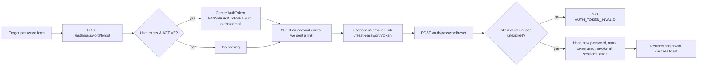

### 2.4 Invitation

Admin invites user (`INVITED`) → `AuthToken INVITATION` (7 days) emailed → user sets password at `/accept-invite` → `emailVerifiedAt` set, status `ACTIVE`, audit `user.activated`.

---

## 3. Ticket Flows

### 3.1 Lifecycle (state diagram)

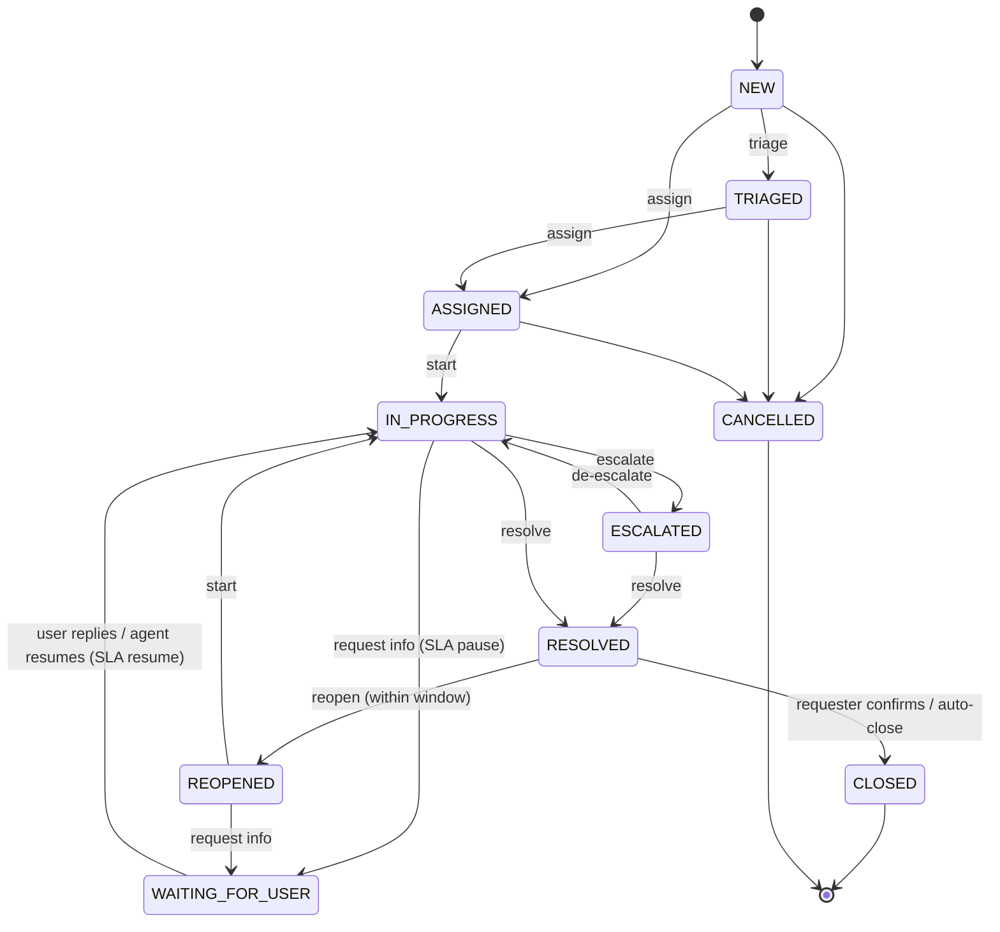

### 3.2 Create ticket — system sequence

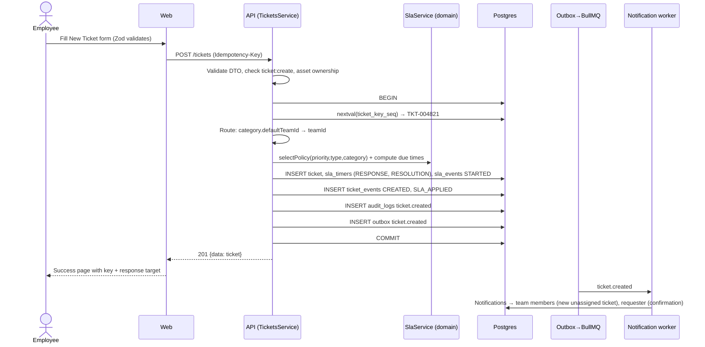

### 3.3 Triage & assignment (agent)

```mermaid
flowchart TD
  A[Agent opens 'Unassigned in my teams'] --> B[Open ticket]
  B --> C{Category & priority correct?}
  C -- no --> D[Edit category/priority → PATCH /tickets/:id]
  D --> D1[SLA recalculated if policy changes → SlaEvent RECALCULATED]
  C -- yes --> E[Triage → POST transitions to=TRIAGED]
  D1 --> E
  E --> F[Assign: choose team + agent or 'Assign to me']
  F --> G[POST /tickets/:id/assignment {version, teamId, assigneeId}]
  G --> H{version matches & assignee ∈ team?}
  H -- stale --> I[409 → ConflictBanner → reload]
  H -- not in team --> J[422 ASSIGNEE_NOT_IN_TEAM]
  H -- ok --> K[status=ASSIGNED, history ASSIGNED, audit, outbox ticket.assigned]
  K --> L[Assignee notified]
```

**Concurrent assignment** (PRD §74): Agent A and B both load v3. A assigns → v4. B's request with v3 updates 0 rows → `409 CONFLICT_STALE_VERSION` with current ticket → B sees "Assigned to Sara by Sara just now".

### 3.4 Work, communicate, wait for user

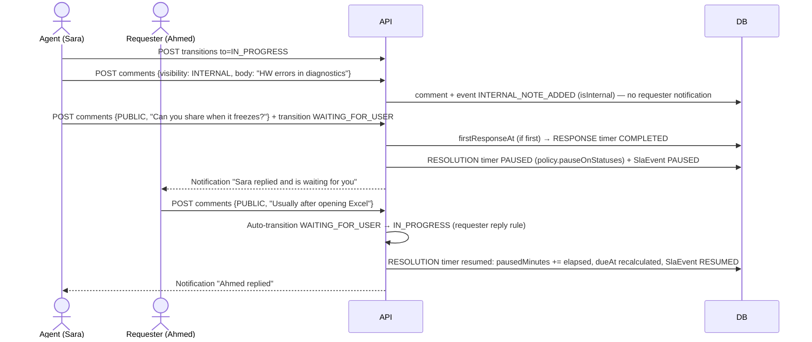

### 3.5 Resolve, confirm, reopen, auto-close

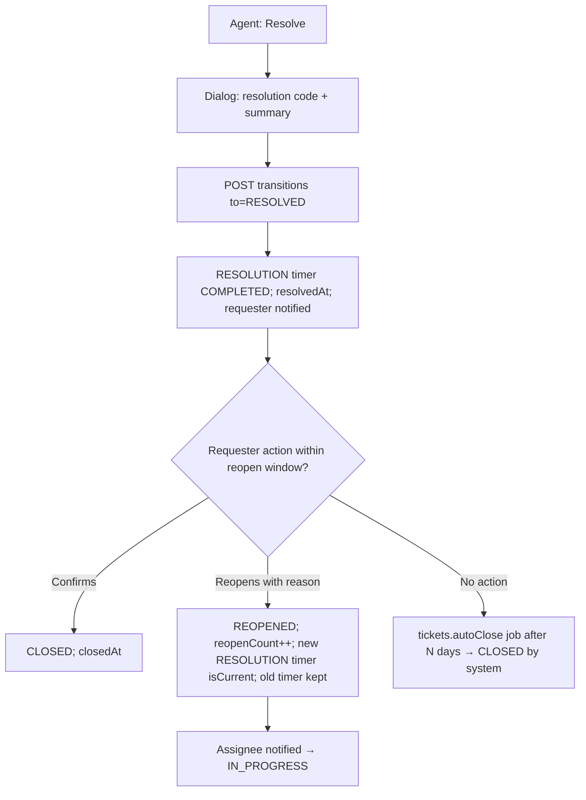

### 3.6 Escalation

Agent escalates (reason required) → `ESCALATED`, team lead + team manager notified, ticket flagged in manager dashboard. Manager may reassign or de-escalate.

### 3.7 Attachments

```mermaid
sequenceDiagram
  participant W as Web
  participant A as API
  participant FS as Storage
  W->>A: POST /tickets/:id/attachments (multipart)
  A->>A: Auth + canView(ticket) + attachment:upload + ticket not terminal
  A->>A: size ≤ 10MB, count ≤ 10, sniff magic bytes ∈ allow-list
  alt rejected
    A-->>W: 413 / 415 / 422
  else ok
    A->>FS: put(storageKey=uuid) 
    A->>A: DB tx: attachment row (sanitized name, sha256), event, audit
    A-->>W: 201 attachment meta
  end
  W->>A: GET /attachments/:aid/download
  A->>A: load attachment → ticket → canView; internal attachment requires view_internal
  A-->>W: stream, Content-Disposition: attachment, nosniff
```

---

## 4. SLA Flows

### 4.1 Timer state

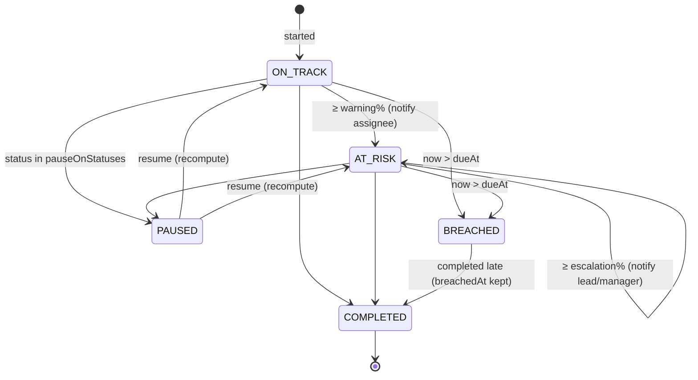

### 4.2 Evaluator job

```mermaid
sequenceDiagram
  participant C as BullMQ repeat (60s)
  participant J as SlaEvaluator
  participant DB as Postgres
  participant O as Outbox
  C->>J: sla.evaluate
  J->>DB: SELECT timers WHERE warn_at <= now() AND warned_at IS NULL ... LIMIT 500
  loop each timer
    J->>DB: BEGIN; UPDATE ... SET warned_at=now() WHERE id=? AND warned_at IS NULL
    alt 1 row updated
      J->>DB: INSERT sla_event WARNING; UPDATE ticket.sla_state
      J->>O: outbox sla.warning
    else 0 rows (another worker did it)
      J->>J: skip
    end
    J->>DB: COMMIT
  end
  Note over J: same for escalate_at → ESCALATED and due_at → BREACHED (+ audit sla.breached, ticket event SLA_BREACHED)
```

---

## 5. Asset Flows

### 5.1 Lifecycle

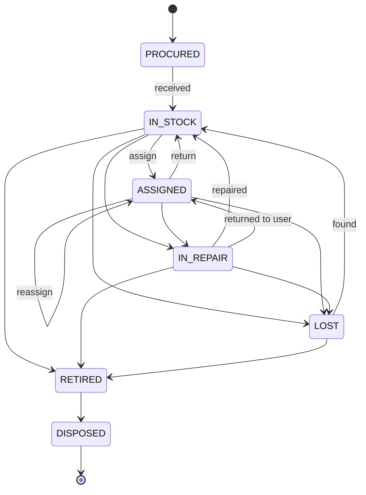

### 5.2 Assign asset (transactional)

```mermaid
sequenceDiagram
  actor Ag as Agent
  participant A as AssetsService
  participant DB as Postgres
  Ag->>A: POST /assets/LAP-00421/assign {version, userId, note}
  A->>A: asset:assign; target user ACTIVE; state machine allows
  A->>DB: BEGIN
  A->>DB: UPDATE asset_assignments SET returned_at=now() WHERE asset_id=? AND returned_at IS NULL
  A->>DB: INSERT asset_assignments (new, active)
  A->>DB: UPDATE assets SET status=ASSIGNED, current_assignee_id=?, version=version+1 WHERE id=? AND version=?
  alt version mismatch / unique index violation
    A->>DB: ROLLBACK → 409
  else ok
    A->>DB: INSERT asset_events ASSIGNED/REASSIGNED, audit asset.assigned, outbox asset.assigned
    A->>DB: COMMIT
  end
```

### 5.3 Ticket → asset → repair (PRD §86 Laptop workflow)

```mermaid
flowchart LR
  T1[Ahmed: ticket 'Laptop keeps freezing' with LAP-00421] --> T2[Desktop Support auto-routed]
  T2 --> T3[Sara assigns self, IN_PROGRESS]
  T3 --> T4[Internal note: HW errors]
  T4 --> A1[Asset → IN_REPAIR from ticket side panel]
  A1 --> A2[Asset event SENT_TO_REPAIR with ticketId]
  A2 --> A3[Repair done → asset back to ASSIGNED to Ahmed]
  A3 --> T5[Ticket RESOLVED: HARDWARE_REPLACED]
  T5 --> T6[Ahmed confirms → CLOSED]
  T6 --> H[History retained: ticket events, asset events, SLA events, audit]
```

---

## 6. Notification Flow

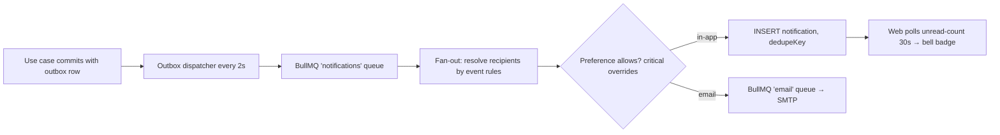

Recipient rules (MVP):

| Event | Recipients |
|---|---|
| `ticket.created` | Requester (confirmation); team members if unassigned |
| `ticket.assigned` | New assignee (if not actor); requester (public: "Assigned to IT") |
| `ticket.status_changed` | Requester (public statuses); watchers |
| `ticket.comment_added` (PUBLIC) | Requester if author is staff; assignee if author is requester; watchers |
| `ticket.comment_added` (INTERNAL) | Assignee + watchers who are staff (never requester) |
| `sla.warning` | Assignee (or team lead if unassigned) |
| `sla.escalated` | Team lead + team manager |
| `sla.breached` | Assignee, team lead, team manager (mandatory) |
| `asset.assigned` | New assignee |

---

## 7. Phase 2 Flows

### 7.1 Major incident (PRD §87 VPN outage)

```mermaid
sequenceDiagram
  actor E1 as Employees
  actor Ag as Agent
  actor M as Manager (IC)
  participant A as API
  E1->>A: 5 tickets "VPN not connecting"
  Ag->>A: Search "VPN" → recognises pattern
  Ag->>A: POST /incidents {SEV1, service: VPN, startedAt, detectedAt}
  A->>A: INC-2026-001, timeline: declared; outbox incident.declared (mandatory notify managers + on-call team)
  Ag->>A: POST /incidents/:id/tickets [5 ticket ids]
  A->>A: IncidentTicket rows; ticket events INCIDENT_LINKED; timeline TICKET_LINKED
  M->>A: transitions INVESTIGATING → MITIGATING (timeline auto entries)
  M->>A: POST timeline {type: MITIGATION, body}
  M->>A: POST notify-requesters "VPN restored, please retry"
  M->>A: transition RESOLVED {rootCause, impact, mitigation}
  M->>A: PUT postmortem ... publish
  M->>A: transition CLOSED (requires published postmortem for SEV1)
```

Incident lifecycle:

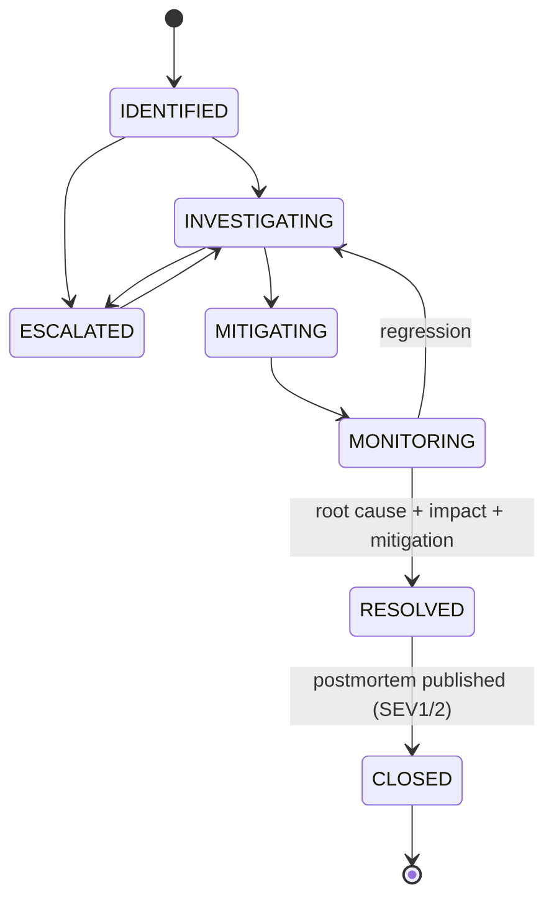

### 7.2 Change request with approvals (PRD §88)

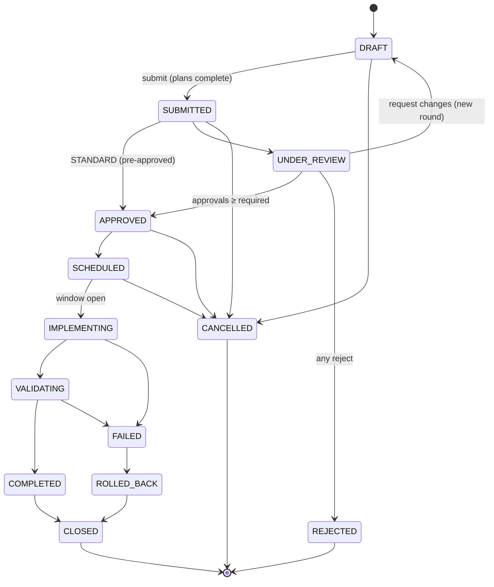

Approval sequence:

```mermaid
sequenceDiagram
  actor Eng as Engineer
  actor M1 as Manager 1
  actor M2 as Manager 2
  participant A as ChangesService
  Eng->>A: POST /changes (DRAFT) → PATCH plans → POST submit
  A->>A: rule(NORMAL,HIGH) → requiredApprovals=2 snapshot; status UNDER_REVIEW; notify approvers
  M1->>A: POST approvals {APPROVED, comment}
  A->>A: check change:approve, approver ≠ requester, unique (change, approver, round)
  A->>A: approvals=1/2 → stay UNDER_REVIEW
  M2->>A: POST approvals {APPROVED}
  A->>A: approvals=2/2 → APPROVED; history + audit; notify engineer
  Eng->>A: transition SCHEDULED → IMPLEMENTING (now ≥ start−15m) → VALIDATING → COMPLETED → CLOSED
```

### 7.3 Onboarding / offboarding (PRD §89–90)

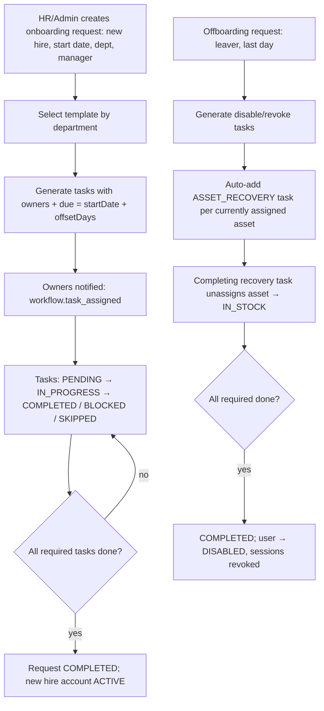

### 7.4 Knowledge article

`DRAFT → REVIEW → PUBLISHED → ARCHIVED` (`REVIEW → DRAFT` on changes requested). Publishing requires `kb:publish` and a reviewer different from author (configurable). On ticket creation, `/kb/suggest` returns published matches by category + text.

---

## 8. End-to-End Test Scenarios (Playwright)

| # | Scenario | Roles | Phase |
|---|---|---|---|
| E2E-1 | Employee creates ticket → agent triages, assigns self, works, resolves → employee sees resolution and closes | employee, agent | MVP |
| E2E-2 | Agent requests info → SLA paused → employee replies → SLA resumes; due time shifts by paused duration | employee, agent | MVP |
| E2E-3 | Employee cannot open another employee's ticket (404) nor see internal notes on own ticket | 2 employees, agent | MVP |
| E2E-4 | Concurrent assignment: two agent sessions; second gets conflict banner | 2 agents | MVP |
| E2E-5 | SLA breach (seeded clock / short policy) shows breached state + notification to manager | agent, manager | MVP |
| E2E-6 | Asset assign → reassign → repair → return; history complete; retired asset cannot be assigned | agent, manager | MVP |
| E2E-7 | Attachment upload rejects disallowed type; employee cannot download internal attachment | employee, agent | MVP |
| E2E-8 | Reopen within window works; after window option hidden and API rejects | employee | MVP |
| E2E-9 | Admin invites user → user accepts → logs in; admin suspends → session revoked | admin | MVP |
| E2E-10 | Change: engineer submits HIGH → manager 1 approves (still under review) → manager 2 approves → scheduled; engineer cannot self-approve | agent, 2 managers | P2 |
| E2E-11 | Incident: link 3 tickets, notify requesters, resolve, publish postmortem, close | agent, manager | P2 |
| E2E-12 | Offboarding: asset recovery task completion unassigns asset; request completes and disables user | admin, agent | P2 |
