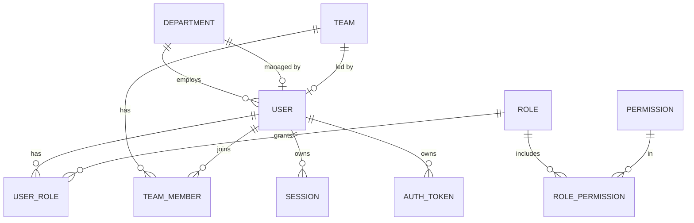
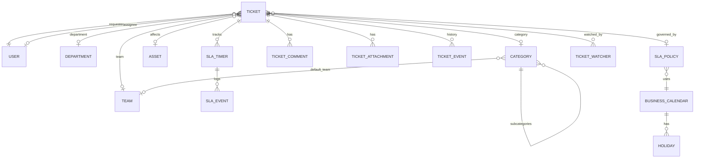
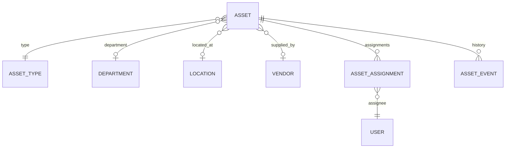
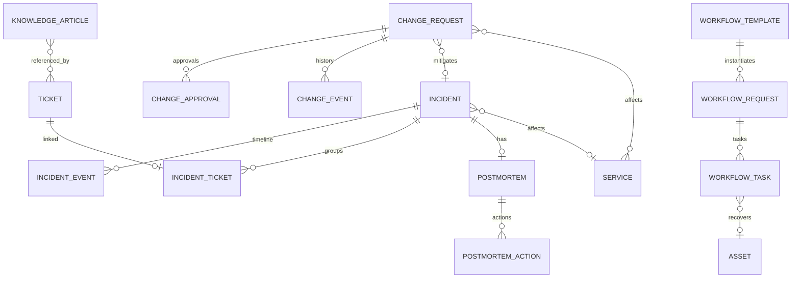

# OpsDesk — Backend Schema

| Field | Value |
|---|---|
| Document | Backend / Database Schema |
| Version | 1.0 |
| Database | PostgreSQL 16 (extensions: `pg_trgm`, `citext`, `btree_gist`) |
| ORM | Prisma 6 |
| Related | [PRD](./01-PRD.md) · [TRD](./02-TRD.md) · [Implementation Plan](./06-Implementation-Plan.md) |

---

## 1. Conventions

| Convention | Rule |
|---|---|
| Table names | `snake_case` plural via `@@map` (e.g. `tickets`) |
| Column names | `snake_case` via `@map`; Prisma fields `camelCase` |
| Primary keys | `id UUID` (UUIDv7 generated in app for time-ordering) |
| Human keys | `key` unique text (`TKT-004821`, `LAP-00421`, `INC-2026-001`, `CHG-000123`, `ONB-000045`) from Postgres sequences |
| Timestamps | `timestamptz`, UTC; `created_at` default `now()`, `updated_at` via `@updatedAt` |
| Soft delete | Only for configuration data (`archived_at`); operational records are never hard-deleted |
| Concurrency | `version INT NOT NULL DEFAULT 1` on mutable aggregates |
| Enums | Postgres enums for fixed lifecycle values; configurable taxonomies are tables |
| Money | `numeric(12,2)` |
| JSON | `jsonb` only for audit diffs, metadata, and template definitions — never for queryable core fields |
| FK deletes | `RESTRICT` by default; `CASCADE` only for owned children of config entities |

---

## 2. Entity Relationship Overview

### 2.1 Identity, access & organization



### 2.2 Service desk & SLA



### 2.3 Assets



### 2.4 Phase 2: incidents, changes, workflows, knowledge



---

## 3. Enums

```prisma
enum UserStatus      { INVITED ACTIVE SUSPENDED DISABLED }
enum AuthTokenType   { PASSWORD_RESET INVITATION EMAIL_VERIFICATION }

enum TicketType      { INCIDENT SERVICE_REQUEST ACCESS_REQUEST HARDWARE_REQUEST SOFTWARE_REQUEST }
enum TicketStatus    { NEW TRIAGED ASSIGNED IN_PROGRESS WAITING_FOR_USER ESCALATED RESOLVED REOPENED CLOSED CANCELLED }
enum Priority        { LOW MEDIUM HIGH CRITICAL }
enum CommentVisibility { PUBLIC INTERNAL }
enum TicketEventType { CREATED UPDATED STATUS_CHANGED PRIORITY_CHANGED CATEGORY_CHANGED ASSIGNED REASSIGNED
                       UNASSIGNED COMMENT_ADDED INTERNAL_NOTE_ADDED ATTACHMENT_ADDED ATTACHMENT_REMOVED
                       SLA_APPLIED SLA_CHANGED SLA_BREACHED ASSET_LINKED ASSET_UNLINKED INCIDENT_LINKED
                       INCIDENT_UNLINKED ARTICLE_LINKED RESOLVED REOPENED CLOSED CANCELLED WATCHER_ADDED }

enum SlaTimerKind    { RESPONSE RESOLUTION }
enum SlaState        { ON_TRACK AT_RISK BREACHED PAUSED COMPLETED CANCELLED }
enum SlaEventType    { STARTED PAUSED RESUMED WARNING ESCALATED BREACHED COMPLETED RECALCULATED CANCELLED }

enum AssetStatus     { PROCURED IN_STOCK ASSIGNED IN_REPAIR LOST RETIRED DISPOSED }
enum AssetEventType  { CREATED RECEIVED ASSIGNED REASSIGNED UNASSIGNED SENT_TO_REPAIR RETURNED_FROM_REPAIR
                       MARKED_LOST FOUND RETIRED DISPOSED UPDATED TICKET_LINKED }

enum NotificationType { TICKET_ASSIGNED TICKET_STATUS_CHANGED TICKET_COMMENT_ADDED TICKET_RESOLVED
                        SLA_WARNING SLA_ESCALATION SLA_BREACHED ASSET_ASSIGNED ASSET_WARRANTY_EXPIRING
                        INCIDENT_DECLARED INCIDENT_UPDATED CHANGE_APPROVAL_REQUESTED CHANGE_DECIDED
                        WORKFLOW_TASK_ASSIGNED MENTION }

// Phase 2
enum IncidentSeverity { SEV1 SEV2 SEV3 SEV4 }
enum IncidentStatus   { IDENTIFIED INVESTIGATING ESCALATED MITIGATING MONITORING RESOLVED CLOSED }
enum IncidentEventType { NOTE STATUS_CHANGED SEVERITY_CHANGED OWNER_CHANGED COMMANDER_CHANGED
                         TICKET_LINKED TICKET_UNLINKED MITIGATION ROOT_CAUSE COMMUNICATION RESOLVED CLOSED }
enum PostmortemStatus { DRAFT IN_REVIEW PUBLISHED }
enum ActionItemStatus { OPEN IN_PROGRESS DONE CANCELLED }

enum ChangeType       { STANDARD NORMAL EMERGENCY }
enum ChangeRisk       { LOW MEDIUM HIGH CRITICAL }
enum ChangeStatus     { DRAFT SUBMITTED UNDER_REVIEW APPROVED REJECTED SCHEDULED IMPLEMENTING VALIDATING
                        COMPLETED FAILED ROLLED_BACK CLOSED CANCELLED }
enum ApprovalDecision { APPROVED REJECTED REQUEST_CHANGES }

enum WorkflowKind     { ONBOARDING OFFBOARDING }
enum WorkflowStatus   { OPEN COMPLETED CANCELLED }
enum TaskStatus       { PENDING IN_PROGRESS BLOCKED COMPLETED SKIPPED }

enum ArticleStatus    { DRAFT REVIEW PUBLISHED ARCHIVED }
```

---

## 4. Prisma Schema

> File: `apps/api/prisma/schema.prisma`. Enums from §3 are included verbatim in the real file. Phase 2 models are included so migrations can be added incrementally; they are created in the Phase 2 migration set.

```prisma
generator client {
  provider        = "prisma-client-js"
  previewFeatures = ["fullTextSearchPostgres", "postgresqlExtensions"]
}

datasource db {
  provider   = "postgresql"
  url        = env("DATABASE_URL")
  extensions = [pg_trgm, citext, btree_gist]
}

// ───────────────────────── Identity & Access ─────────────────────────

model User {
  id            String     @id @db.Uuid
  email         String     @unique @db.Citext
  firstName     String     @map("first_name") @db.VarChar(100)
  lastName      String     @map("last_name") @db.VarChar(100)
  phone         String?    @db.VarChar(30)
  jobTitle      String?    @map("job_title") @db.VarChar(120)
  passwordHash  String?    @map("password_hash")       // null while INVITED
  status        UserStatus @default(INVITED)
  timezone      String     @default("UTC") @db.VarChar(64)
  departmentId  String?    @map("department_id") @db.Uuid
  managerId     String?    @map("manager_id") @db.Uuid // line manager (for workflows)
  emailVerifiedAt DateTime? @map("email_verified_at") @db.Timestamptz
  lastLoginAt   DateTime?  @map("last_login_at") @db.Timestamptz
  failedLoginCount Int     @default(0) @map("failed_login_count")
  lockedUntil   DateTime?  @map("locked_until") @db.Timestamptz
  createdAt     DateTime   @default(now()) @map("created_at") @db.Timestamptz
  updatedAt     DateTime   @updatedAt @map("updated_at") @db.Timestamptz

  department    Department? @relation("DepartmentMembers", fields: [departmentId], references: [id])
  manager       User?       @relation("UserManager", fields: [managerId], references: [id])
  reports       User[]      @relation("UserManager")
  roles         UserRole[]
  teams         TeamMember[]
  sessions      Session[]
  authTokens    AuthToken[]

  requestedTickets Ticket[] @relation("TicketRequester")
  assignedTickets  Ticket[] @relation("TicketAssignee")
  assetAssignments AssetAssignment[] @relation("AssetAssignee")
  notifications    Notification[]

  @@index([departmentId])
  @@index([status])
  @@map("users")
}

model Role {
  id          String  @id @db.Uuid
  key         String  @unique @db.VarChar(50)   // EMPLOYEE, AGENT, MANAGER, ADMIN
  name        String  @db.VarChar(100)
  description String?
  isSystem    Boolean @default(true) @map("is_system")
  permissions RolePermission[]
  users       UserRole[]
  @@map("roles")
}

model Permission {
  id          String @id @db.Uuid
  key         String @unique @db.VarChar(80)    // ticket:assign
  resource    String @db.VarChar(40)
  action      String @db.VarChar(40)
  description String?
  roles       RolePermission[]
  @@map("permissions")
}

model RolePermission {
  roleId       String @map("role_id") @db.Uuid
  permissionId String @map("permission_id") @db.Uuid
  role         Role       @relation(fields: [roleId], references: [id], onDelete: Cascade)
  permission   Permission @relation(fields: [permissionId], references: [id], onDelete: Cascade)
  @@id([roleId, permissionId])
  @@map("role_permissions")
}

model UserRole {
  userId     String   @map("user_id") @db.Uuid
  roleId     String   @map("role_id") @db.Uuid
  assignedAt DateTime @default(now()) @map("assigned_at") @db.Timestamptz
  assignedById String? @map("assigned_by_id") @db.Uuid
  user       User @relation(fields: [userId], references: [id], onDelete: Cascade)
  role       Role @relation(fields: [roleId], references: [id], onDelete: Restrict)
  @@id([userId, roleId])
  @@index([roleId])
  @@map("user_roles")
}

model Session {
  id               String    @id @db.Uuid
  userId           String    @map("user_id") @db.Uuid
  refreshTokenHash String    @unique @map("refresh_token_hash")
  familyId         String    @map("family_id") @db.Uuid   // rotation family for reuse detection
  userAgent        String?   @map("user_agent")
  ip               String?   @db.Inet
  expiresAt        DateTime  @map("expires_at") @db.Timestamptz
  revokedAt        DateTime? @map("revoked_at") @db.Timestamptz
  replacedById     String?   @map("replaced_by_id") @db.Uuid
  createdAt        DateTime  @default(now()) @map("created_at") @db.Timestamptz
  lastUsedAt       DateTime? @map("last_used_at") @db.Timestamptz
  user             User @relation(fields: [userId], references: [id], onDelete: Cascade)
  @@index([userId])
  @@index([familyId])
  @@map("sessions")
}

model AuthToken {
  id         String        @id @db.Uuid
  userId     String        @map("user_id") @db.Uuid
  type       AuthTokenType
  tokenHash  String        @unique @map("token_hash")  // sha256 of random token
  expiresAt  DateTime      @map("expires_at") @db.Timestamptz
  usedAt     DateTime?     @map("used_at") @db.Timestamptz
  createdAt  DateTime      @default(now()) @map("created_at") @db.Timestamptz
  user       User @relation(fields: [userId], references: [id], onDelete: Cascade)
  @@index([userId, type])
  @@map("auth_tokens")
}

// ───────────────────────── Organization ─────────────────────────

model Department {
  id         String    @id @db.Uuid
  name       String    @unique @db.VarChar(100)
  code       String    @unique @db.VarChar(20)
  headId     String?   @map("head_id") @db.Uuid
  archivedAt DateTime? @map("archived_at") @db.Timestamptz
  createdAt  DateTime  @default(now()) @map("created_at") @db.Timestamptz
  updatedAt  DateTime  @updatedAt @map("updated_at") @db.Timestamptz
  members    User[]    @relation("DepartmentMembers")
  @@map("departments")
}

model Team {
  id          String    @id @db.Uuid
  name        String    @unique @db.VarChar(100)
  description String?
  email       String?   @db.Citext
  leadId      String?   @map("lead_id") @db.Uuid
  managerId   String?   @map("manager_id") @db.Uuid    // manager scope for view_all
  archivedAt  DateTime? @map("archived_at") @db.Timestamptz
  createdAt   DateTime  @default(now()) @map("created_at") @db.Timestamptz
  updatedAt   DateTime  @updatedAt @map("updated_at") @db.Timestamptz
  members     TeamMember[]
  tickets     Ticket[]
  @@map("teams")
}

model TeamMember {
  teamId   String   @map("team_id") @db.Uuid
  userId   String   @map("user_id") @db.Uuid
  joinedAt DateTime @default(now()) @map("joined_at") @db.Timestamptz
  team     Team @relation(fields: [teamId], references: [id], onDelete: Cascade)
  user     User @relation(fields: [userId], references: [id], onDelete: Cascade)
  @@id([teamId, userId])
  @@index([userId])
  @@map("team_members")
}

// ───────────────────────── Catalog ─────────────────────────

model Category {
  id            String    @id @db.Uuid
  name          String    @db.VarChar(100)
  parentId      String?   @map("parent_id") @db.Uuid
  defaultTeamId String?   @map("default_team_id") @db.Uuid
  description   String?
  sortOrder     Int       @default(0) @map("sort_order")
  isActive      Boolean   @default(true) @map("is_active")
  createdAt     DateTime  @default(now()) @map("created_at") @db.Timestamptz
  updatedAt     DateTime  @updatedAt @map("updated_at") @db.Timestamptz
  parent        Category?  @relation("CategoryTree", fields: [parentId], references: [id], onDelete: Restrict)
  children      Category[] @relation("CategoryTree")
  @@unique([parentId, name])
  @@map("categories")
}

model ResolutionCode {
  id       String  @id @db.Uuid
  code     String  @unique @db.VarChar(40)   // FIXED, WORKAROUND, DUPLICATE, NOT_REPRODUCIBLE, USER_ERROR, HARDWARE_REPLACED
  label    String  @db.VarChar(100)
  isActive Boolean @default(true) @map("is_active")
  @@map("resolution_codes")
}

// ───────────────────────── Tickets ─────────────────────────

model Ticket {
  id              String       @id @db.Uuid
  key             String       @unique @db.VarChar(20)    // TKT-004821
  title           String       @db.VarChar(200)
  description     String       @db.Text
  type            TicketType
  status          TicketStatus @default(NEW)
  priority        Priority     @default(MEDIUM)
  requestedPriority Priority?  @map("requested_priority")
  categoryId      String?      @map("category_id") @db.Uuid
  subcategoryId   String?      @map("subcategory_id") @db.Uuid
  requesterId     String       @map("requester_id") @db.Uuid
  createdById     String       @map("created_by_id") @db.Uuid   // agent may log on behalf
  assigneeId      String?      @map("assignee_id") @db.Uuid
  teamId          String?      @map("team_id") @db.Uuid
  departmentId    String?      @map("department_id") @db.Uuid    // requester's dept at creation
  assetId         String?      @map("asset_id") @db.Uuid
  slaPolicyId     String?      @map("sla_policy_id") @db.Uuid
  slaState        SlaState?    @map("sla_state")                 // denormalized worst-of timers, for filtering
  resolutionCodeId String?     @map("resolution_code_id") @db.Uuid
  resolutionSummary String?    @map("resolution_summary") @db.Text
  reopenCount     Int          @default(0) @map("reopen_count")
  firstResponseAt DateTime?    @map("first_response_at") @db.Timestamptz
  dueAt           DateTime?    @map("due_at") @db.Timestamptz    // resolution due (denormalized)
  resolvedAt      DateTime?    @map("resolved_at") @db.Timestamptz
  closedAt        DateTime?    @map("closed_at") @db.Timestamptz
  cancelledAt     DateTime?    @map("cancelled_at") @db.Timestamptz
  version         Int          @default(1)
  createdAt       DateTime     @default(now()) @map("created_at") @db.Timestamptz
  updatedAt       DateTime     @updatedAt @map("updated_at") @db.Timestamptz
  // search_vector tsvector GENERATED ALWAYS AS (...) STORED — added in raw migration (§5)

  requester      User      @relation("TicketRequester", fields: [requesterId], references: [id])
  assignee       User?     @relation("TicketAssignee", fields: [assigneeId], references: [id])
  team           Team?     @relation(fields: [teamId], references: [id])
  asset          Asset?    @relation(fields: [assetId], references: [id])
  slaPolicy      SlaPolicy? @relation(fields: [slaPolicyId], references: [id])
  comments       TicketComment[]
  attachments    TicketAttachment[]
  events         TicketEvent[]
  slaTimers      SlaTimer[]
  watchers       TicketWatcher[]
  incidentLink   IncidentTicket?
  articles       TicketArticle[]

  @@index([status, priority])
  @@index([assigneeId, status])
  @@index([teamId, status])
  @@index([requesterId, createdAt(sort: Desc)])
  @@index([categoryId])
  @@index([departmentId])
  @@index([assetId])
  @@index([slaState])
  @@index([dueAt])
  @@index([createdAt(sort: Desc)])
  @@map("tickets")
}

model TicketWatcher {
  ticketId String   @map("ticket_id") @db.Uuid
  userId   String   @map("user_id") @db.Uuid
  addedAt  DateTime @default(now()) @map("added_at") @db.Timestamptz
  ticket   Ticket @relation(fields: [ticketId], references: [id], onDelete: Cascade)
  @@id([ticketId, userId])
  @@index([userId])
  @@map("ticket_watchers")
}

model TicketComment {
  id         String            @id @db.Uuid
  ticketId   String            @map("ticket_id") @db.Uuid
  authorId   String            @map("author_id") @db.Uuid
  visibility CommentVisibility @default(PUBLIC)
  body       String            @db.Text      // Markdown, sanitized on render
  editedAt   DateTime?         @map("edited_at") @db.Timestamptz
  createdAt  DateTime          @default(now()) @map("created_at") @db.Timestamptz
  ticket     Ticket @relation(fields: [ticketId], references: [id], onDelete: Restrict)
  attachments TicketAttachment[]
  @@index([ticketId, createdAt])
  @@map("ticket_comments")
}

model TicketAttachment {
  id           String    @id @db.Uuid
  ticketId     String    @map("ticket_id") @db.Uuid
  commentId    String?   @map("comment_id") @db.Uuid
  uploadedById String    @map("uploaded_by_id") @db.Uuid
  originalName String    @map("original_name") @db.VarChar(255) // sanitized
  storageKey   String    @unique @map("storage_key")             // random UUID path
  mimeType     String    @map("mime_type") @db.VarChar(100)       // sniffed, not client-provided
  sizeBytes    Int       @map("size_bytes")
  sha256       String    @db.Char(64)
  isInternal   Boolean   @default(false) @map("is_internal")     // inherits from internal note
  deletedAt    DateTime? @map("deleted_at") @db.Timestamptz
  deletedById  String?   @map("deleted_by_id") @db.Uuid
  createdAt    DateTime  @default(now()) @map("created_at") @db.Timestamptz
  ticket       Ticket         @relation(fields: [ticketId], references: [id], onDelete: Restrict)
  comment      TicketComment? @relation(fields: [commentId], references: [id])
  @@index([ticketId])
  @@map("ticket_attachments")
}

/// Append-only ticket history (aka TicketStatusHistory, generalized).
model TicketEvent {
  id        String          @id @db.Uuid
  ticketId  String          @map("ticket_id") @db.Uuid
  actorId   String?         @map("actor_id") @db.Uuid   // null = system
  type      TicketEventType
  fromValue String?         @map("from_value")
  toValue   String?         @map("to_value")
  metadata  Json?           // e.g. {reason, teamId, assigneeId, commentId}
  isInternal Boolean        @default(false) @map("is_internal") // hidden from requester
  createdAt DateTime        @default(now()) @map("created_at") @db.Timestamptz
  ticket    Ticket @relation(fields: [ticketId], references: [id], onDelete: Restrict)
  @@index([ticketId, createdAt])
  @@index([type, createdAt])
  @@map("ticket_events")
}

// ───────────────────────── SLA ─────────────────────────

model BusinessCalendar {
  id        String  @id @db.Uuid
  name      String  @unique @db.VarChar(100)
  timezone  String  @db.VarChar(64)          // IANA, e.g. Asia/Karachi
  is24x7    Boolean @default(false) @map("is_24x7")
  /// [{weekday:1,start:"09:00",end:"18:00"}, ...] weekday 1=Mon..7=Sun
  schedule  Json
  holidays  Holiday[]
  policies  SlaPolicy[]
  @@map("business_calendars")
}

model Holiday {
  id         String   @id @db.Uuid
  calendarId String   @map("calendar_id") @db.Uuid
  date       DateTime @db.Date
  name       String   @db.VarChar(100)
  calendar   BusinessCalendar @relation(fields: [calendarId], references: [id], onDelete: Cascade)
  @@unique([calendarId, date])
  @@map("holidays")
}

model SlaPolicy {
  id                     String      @id @db.Uuid
  name                   String      @unique @db.VarChar(100)
  description            String?
  priority               Priority?   // null = any
  ticketType             TicketType? @map("ticket_type")
  categoryId             String?     @map("category_id") @db.Uuid
  calendarId             String      @map("calendar_id") @db.Uuid
  firstResponseMinutes   Int         @map("first_response_minutes")
  resolutionMinutes      Int         @map("resolution_minutes")
  warningPercent         Int         @default(75) @map("warning_percent")
  escalationPercent      Int         @default(90) @map("escalation_percent")
  /// statuses during which the RESOLUTION timer pauses, e.g. ["WAITING_FOR_USER"]
  pauseOnStatuses        TicketStatus[] @map("pause_on_statuses")
  isDefault              Boolean     @default(false) @map("is_default")
  isActive               Boolean     @default(true) @map("is_active")
  sortOrder              Int         @default(0) @map("sort_order")
  createdAt              DateTime    @default(now()) @map("created_at") @db.Timestamptz
  updatedAt              DateTime    @updatedAt @map("updated_at") @db.Timestamptz
  calendar               BusinessCalendar @relation(fields: [calendarId], references: [id])
  tickets                Ticket[]
  @@index([isActive, priority])
  @@map("sla_policies")
}

model SlaTimer {
  id             String       @id @db.Uuid
  ticketId       String       @map("ticket_id") @db.Uuid
  policyId       String       @map("policy_id") @db.Uuid
  kind           SlaTimerKind
  targetMinutes  Int          @map("target_minutes")
  state          SlaState     @default(ON_TRACK)
  startedAt      DateTime     @map("started_at") @db.Timestamptz
  warnAt         DateTime     @map("warn_at") @db.Timestamptz      // precomputed thresholds
  escalateAt     DateTime     @map("escalate_at") @db.Timestamptz
  dueAt          DateTime     @map("due_at") @db.Timestamptz
  pausedAt       DateTime?    @map("paused_at") @db.Timestamptz
  pausedMinutes  Int          @default(0) @map("paused_minutes")
  warnedAt       DateTime?    @map("warned_at") @db.Timestamptz
  escalatedAt    DateTime?    @map("escalated_at") @db.Timestamptz
  breachedAt     DateTime?    @map("breached_at") @db.Timestamptz
  completedAt    DateTime?    @map("completed_at") @db.Timestamptz
  cancelledAt    DateTime?    @map("cancelled_at") @db.Timestamptz
  isCurrent      Boolean      @default(true) @map("is_current")     // false for superseded (e.g. pre-reopen)
  ticket         Ticket @relation(fields: [ticketId], references: [id], onDelete: Restrict)
  events         SlaEvent[]
  @@index([ticketId])
  @@map("sla_timers")
  // partial indexes for the evaluator + one-current-timer-per-kind added in raw SQL (§5)
}

model SlaEvent {
  id        String       @id @db.Uuid
  timerId   String       @map("timer_id") @db.Uuid
  ticketId  String       @map("ticket_id") @db.Uuid
  type      SlaEventType
  metadata  Json?        // {oldDueAt,newDueAt,policyId,percent}
  createdAt DateTime     @default(now()) @map("created_at") @db.Timestamptz
  timer     SlaTimer @relation(fields: [timerId], references: [id], onDelete: Restrict)
  @@index([ticketId, createdAt])
  @@index([type, createdAt])
  @@map("sla_events")
}

// ───────────────────────── Assets ─────────────────────────

model AssetType {
  id        String  @id @db.Uuid
  name      String  @unique @db.VarChar(80)   // Laptop, Monitor, ...
  tagPrefix String  @unique @map("tag_prefix") @db.VarChar(6)  // LAP, MON
  isActive  Boolean @default(true) @map("is_active")
  assets    Asset[]
  @@map("asset_types")
}

model Location {
  id     String  @id @db.Uuid
  name   String  @unique @db.VarChar(120)
  address String?
  assets Asset[]
  @@map("locations")
}

model Vendor {
  id      String  @id @db.Uuid
  name    String  @unique @db.VarChar(120)
  contact String?
  assets  Asset[]
  @@map("vendors")
}

model Asset {
  id             String      @id @db.Uuid
  tag            String      @unique @db.VarChar(20)        // LAP-00421
  typeId         String      @map("type_id") @db.Uuid
  name           String      @db.VarChar(150)
  manufacturer   String?     @db.VarChar(100)
  model          String?     @db.VarChar(100)
  serialNumber   String?     @unique @map("serial_number") @db.VarChar(100)
  status         AssetStatus @default(PROCURED)
  purchaseDate   DateTime?   @map("purchase_date") @db.Date
  purchaseCost   Decimal?    @map("purchase_cost") @db.Decimal(12, 2)
  warrantyExpiry DateTime?   @map("warranty_expiry") @db.Date
  vendorId       String?     @map("vendor_id") @db.Uuid
  locationId     String?     @map("location_id") @db.Uuid
  departmentId   String?     @map("department_id") @db.Uuid
  currentAssigneeId String?  @map("current_assignee_id") @db.Uuid  // denormalized for filtering
  notes          String?     @db.Text
  disposalMethod String?     @map("disposal_method") @db.VarChar(100)
  version        Int         @default(1)
  createdAt      DateTime    @default(now()) @map("created_at") @db.Timestamptz
  updatedAt      DateTime    @updatedAt @map("updated_at") @db.Timestamptz
  type           AssetType  @relation(fields: [typeId], references: [id])
  vendor         Vendor?    @relation(fields: [vendorId], references: [id])
  location       Location?  @relation(fields: [locationId], references: [id])
  assignments    AssetAssignment[]
  events         AssetEvent[]
  tickets        Ticket[]
  @@index([typeId, status])
  @@index([status])
  @@index([departmentId])
  @@index([currentAssigneeId])
  @@index([warrantyExpiry])
  @@index([locationId])
  @@map("assets")
}

model AssetAssignment {
  id             String    @id @db.Uuid
  assetId        String    @map("asset_id") @db.Uuid
  userId         String    @map("user_id") @db.Uuid
  assignedById   String    @map("assigned_by_id") @db.Uuid
  assignedAt     DateTime  @default(now()) @map("assigned_at") @db.Timestamptz
  returnedAt     DateTime? @map("returned_at") @db.Timestamptz
  returnedById   String?   @map("returned_by_id") @db.Uuid
  returnCondition String?  @map("return_condition") @db.VarChar(50)
  note           String?
  asset          Asset @relation(fields: [assetId], references: [id], onDelete: Restrict)
  user           User  @relation("AssetAssignee", fields: [userId], references: [id], onDelete: Restrict)
  @@index([assetId, assignedAt(sort: Desc)])
  @@index([userId])
  @@map("asset_assignments")
  // UNIQUE (asset_id) WHERE returned_at IS NULL  — raw SQL (§5)
}

model AssetEvent {
  id        String         @id @db.Uuid
  assetId   String         @map("asset_id") @db.Uuid
  actorId   String?        @map("actor_id") @db.Uuid
  type      AssetEventType
  fromValue String?        @map("from_value")
  toValue   String?        @map("to_value")
  metadata  Json?          // {userId, ticketId, note, vendor}
  createdAt DateTime       @default(now()) @map("created_at") @db.Timestamptz
  asset     Asset @relation(fields: [assetId], references: [id], onDelete: Restrict)
  @@index([assetId, createdAt])
  @@map("asset_events")
}

// ───────────────────────── Notifications, Audit, Outbox, Settings ─────────────────────────

model Notification {
  id          String           @id @db.Uuid
  recipientId String           @map("recipient_id") @db.Uuid
  type        NotificationType
  title       String           @db.VarChar(200)
  message     String           @db.VarChar(1000)
  entityType  String?          @map("entity_type") @db.VarChar(40)
  entityId    String?          @map("entity_id") @db.Uuid
  link        String?          @db.VarChar(300)    // e.g. /tickets/TKT-004821
  readAt      DateTime?        @map("read_at") @db.Timestamptz
  dedupeKey   String?          @map("dedupe_key") @db.VarChar(200)
  createdAt   DateTime         @default(now()) @map("created_at") @db.Timestamptz
  recipient   User @relation(fields: [recipientId], references: [id], onDelete: Cascade)
  @@unique([recipientId, dedupeKey])
  @@index([recipientId, createdAt(sort: Desc)])
  @@map("notifications")
  // partial index (recipient_id) WHERE read_at IS NULL — raw SQL
}

model NotificationPreference {
  userId    String           @map("user_id") @db.Uuid
  type      NotificationType
  inApp     Boolean          @default(true) @map("in_app")
  email     Boolean          @default(false)
  @@id([userId, type])
  @@map("notification_preferences")
}

/// Append-only. App DB role has INSERT/SELECT only; trigger blocks UPDATE/DELETE.
model AuditLog {
  id         String   @id @db.Uuid
  actorId    String?  @map("actor_id") @db.Uuid        // null = system
  actorEmail String?  @map("actor_email") @db.Citext   // snapshot
  action     String   @db.VarChar(80)                  // ticket.assigned
  entityType String   @map("entity_type") @db.VarChar(40)
  entityId   String?  @map("entity_id") @db.Uuid
  entityKey  String?  @map("entity_key") @db.VarChar(30)
  before     Json?
  after      Json?
  metadata   Json?
  requestId  String?  @map("request_id") @db.VarChar(40)
  ip         String?  @db.Inet
  userAgent  String?  @map("user_agent") @db.VarChar(300)
  createdAt  DateTime @default(now()) @map("created_at") @db.Timestamptz
  @@index([entityType, entityId, createdAt(sort: Desc)])
  @@index([actorId, createdAt(sort: Desc)])
  @@index([action, createdAt(sort: Desc)])
  @@index([createdAt(sort: Desc)])
  @@map("audit_logs")
}

model OutboxEvent {
  id          String    @id @db.Uuid
  type        String    @db.VarChar(80)    // ticket.assigned
  aggregateType String  @map("aggregate_type") @db.VarChar(40)
  aggregateId String    @map("aggregate_id") @db.Uuid
  payload     Json
  attempts    Int       @default(0)
  lastError   String?   @map("last_error")
  processedAt DateTime? @map("processed_at") @db.Timestamptz
  createdAt   DateTime  @default(now()) @map("created_at") @db.Timestamptz
  @@map("outbox_events")
  // partial index (created_at) WHERE processed_at IS NULL — raw SQL
}

model IdempotencyKey {
  key        String   @id @db.VarChar(100)
  userId     String   @map("user_id") @db.Uuid
  route      String   @db.VarChar(200)
  statusCode Int      @map("status_code")
  response   Json
  createdAt  DateTime @default(now()) @map("created_at") @db.Timestamptz
  @@index([createdAt])
  @@map("idempotency_keys")
}

model Setting {
  key       String   @id @db.VarChar(80)     // reopen_window_days, auto_close_enabled, ...
  value     Json
  updatedById String? @map("updated_by_id") @db.Uuid
  updatedAt DateTime @updatedAt @map("updated_at") @db.Timestamptz
  @@map("settings")
}

// ───────────────────────── Phase 2: Services & Incidents ─────────────────────────

model Service {
  id          String  @id @db.Uuid
  name        String  @unique @db.VarChar(120)   // VPN, Email, Website, IdP
  description String?
  ownerTeamId String? @map("owner_team_id") @db.Uuid
  isActive    Boolean @default(true) @map("is_active")
  incidents   Incident[]
  changes     ChangeService[]
  @@map("services")
}

model Incident {
  id            String           @id @db.Uuid
  key           String           @unique @db.VarChar(20)    // INC-2026-001
  title         String           @db.VarChar(200)
  description   String           @db.Text
  severity      IncidentSeverity
  status        IncidentStatus   @default(IDENTIFIED)
  serviceId     String?          @map("service_id") @db.Uuid
  impact        String?          @db.Text
  ownerId       String?          @map("owner_id") @db.Uuid
  commanderId   String?          @map("commander_id") @db.Uuid
  teamId        String?          @map("team_id") @db.Uuid
  startedAt     DateTime         @map("started_at") @db.Timestamptz
  detectedAt    DateTime         @map("detected_at") @db.Timestamptz
  mitigatedAt   DateTime?        @map("mitigated_at") @db.Timestamptz
  resolvedAt    DateTime?        @map("resolved_at") @db.Timestamptz
  closedAt      DateTime?        @map("closed_at") @db.Timestamptz
  detectionMethod String?        @map("detection_method") @db.VarChar(100)
  rootCause     String?          @map("root_cause") @db.Text
  mitigation    String?          @db.Text
  resolution    String?          @db.Text
  preventiveAction String?       @map("preventive_action") @db.Text
  declaredById  String           @map("declared_by_id") @db.Uuid
  version       Int              @default(1)
  createdAt     DateTime         @default(now()) @map("created_at") @db.Timestamptz
  updatedAt     DateTime         @updatedAt @map("updated_at") @db.Timestamptz
  service       Service?  @relation(fields: [serviceId], references: [id])
  events        IncidentEvent[]
  tickets       IncidentTicket[]
  postmortem    Postmortem?
  changes       ChangeRequest[]
  @@index([status, severity])
  @@index([serviceId])
  @@index([createdAt(sort: Desc)])
  @@map("incidents")
}

/// Append-only timeline. Corrections are new events referencing `correctsEventId`.
model IncidentEvent {
  id              String            @id @db.Uuid
  incidentId      String            @map("incident_id") @db.Uuid
  actorId         String?           @map("actor_id") @db.Uuid
  type            IncidentEventType
  body            String?           @db.Text
  fromValue       String?           @map("from_value")
  toValue         String?           @map("to_value")
  occurredAt      DateTime          @map("occurred_at") @db.Timestamptz   // may be backdated
  correctsEventId String?           @map("corrects_event_id") @db.Uuid
  createdAt       DateTime          @default(now()) @map("created_at") @db.Timestamptz
  incident        Incident @relation(fields: [incidentId], references: [id], onDelete: Restrict)
  @@index([incidentId, occurredAt])
  @@map("incident_events")
}

model IncidentTicket {
  incidentId String   @map("incident_id") @db.Uuid
  ticketId   String   @unique @map("ticket_id") @db.Uuid    // a ticket links to ≤ 1 incident
  linkedById String   @map("linked_by_id") @db.Uuid
  linkedAt   DateTime @default(now()) @map("linked_at") @db.Timestamptz
  incident   Incident @relation(fields: [incidentId], references: [id], onDelete: Restrict)
  ticket     Ticket   @relation(fields: [ticketId], references: [id], onDelete: Restrict)
  @@id([incidentId, ticketId])
  @@map("incident_tickets")
}

model Postmortem {
  id                  String           @id @db.Uuid
  incidentId          String           @unique @map("incident_id") @db.Uuid
  status              PostmortemStatus @default(DRAFT)
  summary             String?          @db.Text
  impact              String?          @db.Text
  timelineSummary     String?          @map("timeline_summary") @db.Text
  rootCause           String?          @map("root_cause") @db.Text
  contributingFactors String?          @map("contributing_factors") @db.Text
  wentWell            String?          @map("went_well") @db.Text
  wentWrong           String?          @map("went_wrong") @db.Text
  ownerId             String?          @map("owner_id") @db.Uuid
  publishedAt         DateTime?        @map("published_at") @db.Timestamptz
  version             Int              @default(1)
  createdAt           DateTime         @default(now()) @map("created_at") @db.Timestamptz
  updatedAt           DateTime         @updatedAt @map("updated_at") @db.Timestamptz
  incident            Incident @relation(fields: [incidentId], references: [id], onDelete: Restrict)
  actions             PostmortemAction[]
  @@map("postmortems")
}

model PostmortemAction {
  id           String           @id @db.Uuid
  postmortemId String           @map("postmortem_id") @db.Uuid
  kind         String           @db.VarChar(20)    // CORRECTIVE | PREVENTIVE
  description  String           @db.Text
  ownerId      String?          @map("owner_id") @db.Uuid
  dueDate      DateTime?        @map("due_date") @db.Date
  status       ActionItemStatus @default(OPEN)
  completedAt  DateTime?        @map("completed_at") @db.Timestamptz
  postmortem   Postmortem @relation(fields: [postmortemId], references: [id], onDelete: Cascade)
  @@index([ownerId, status])
  @@map("postmortem_actions")
}

// ───────────────────────── Phase 2: Changes ─────────────────────────

model ChangeRequest {
  id                 String       @id @db.Uuid
  key                String       @unique @db.VarChar(20)   // CHG-000123
  title              String       @db.VarChar(200)
  description        String       @db.Text
  type               ChangeType
  risk               ChangeRisk
  status             ChangeStatus @default(DRAFT)
  requesterId        String       @map("requester_id") @db.Uuid
  ownerId            String?      @map("owner_id") @db.Uuid
  teamId             String?      @map("team_id") @db.Uuid
  incidentId         String?      @map("incident_id") @db.Uuid
  scheduledStart     DateTime?    @map("scheduled_start") @db.Timestamptz
  scheduledEnd       DateTime?    @map("scheduled_end") @db.Timestamptz
  actualStart        DateTime?    @map("actual_start") @db.Timestamptz
  actualEnd          DateTime?    @map("actual_end") @db.Timestamptz
  implementationPlan String?      @map("implementation_plan") @db.Text
  validationPlan     String?      @map("validation_plan") @db.Text
  rollbackPlan       String?      @map("rollback_plan") @db.Text
  impactAnalysis     String?      @map("impact_analysis") @db.Text
  outcomeNotes       String?      @map("outcome_notes") @db.Text
  approvalRound      Int          @default(1) @map("approval_round")
  requiredApprovals  Int          @default(1) @map("required_approvals")  // snapshot of rule at submit
  version            Int          @default(1)
  createdAt          DateTime     @default(now()) @map("created_at") @db.Timestamptz
  updatedAt          DateTime     @updatedAt @map("updated_at") @db.Timestamptz
  incident           Incident? @relation(fields: [incidentId], references: [id])
  approvals          ChangeApproval[]
  events             ChangeEvent[]
  services           ChangeService[]
  @@index([status])
  @@index([scheduledStart, scheduledEnd])
  @@index([requesterId])
  @@map("change_requests")
  // CHECK (scheduled_end > scheduled_start) — raw SQL
}

model ChangeService {
  changeId  String @map("change_id") @db.Uuid
  serviceId String @map("service_id") @db.Uuid
  change    ChangeRequest @relation(fields: [changeId], references: [id], onDelete: Cascade)
  service   Service       @relation(fields: [serviceId], references: [id], onDelete: Restrict)
  @@id([changeId, serviceId])
  @@map("change_services")
}

model ChangeApprovalRule {
  id                String     @id @db.Uuid
  type              ChangeType
  risk              ChangeRisk
  requiredApprovals Int        @map("required_approvals")
  approverRoleKey   String     @map("approver_role_key") @db.VarChar(50)
  requiresAdmin     Boolean    @default(false) @map("requires_admin")
  @@unique([type, risk])
  @@map("change_approval_rules")
}

/// Append-only decisions. Never updated.
model ChangeApproval {
  id         String           @id @db.Uuid
  changeId   String           @map("change_id") @db.Uuid
  approverId String           @map("approver_id") @db.Uuid
  round      Int
  decision   ApprovalDecision
  comment    String?          @db.Text
  createdAt  DateTime         @default(now()) @map("created_at") @db.Timestamptz
  change     ChangeRequest @relation(fields: [changeId], references: [id], onDelete: Restrict)
  @@unique([changeId, approverId, round])
  @@index([approverId])
  @@map("change_approvals")
}

model ChangeEvent {
  id        String   @id @db.Uuid
  changeId  String   @map("change_id") @db.Uuid
  actorId   String?  @map("actor_id") @db.Uuid
  type      String   @db.VarChar(40)  // SUBMITTED, STATUS_CHANGED, APPROVAL_RECORDED, SCHEDULED, ...
  fromValue String?  @map("from_value")
  toValue   String?  @map("to_value")
  metadata  Json?
  createdAt DateTime @default(now()) @map("created_at") @db.Timestamptz
  change    ChangeRequest @relation(fields: [changeId], references: [id], onDelete: Restrict)
  @@index([changeId, createdAt])
  @@map("change_events")
}

// ───────────────────────── Phase 2: Onboarding / Offboarding ─────────────────────────

model WorkflowTemplate {
  id           String       @id @db.Uuid
  kind         WorkflowKind
  name         String       @db.VarChar(120)
  departmentId String?      @map("department_id") @db.Uuid   // null = default for all
  /// [{title, description, ownerTeamId?, ownerRoleKey?, offsetDays, required, kind:"ASSET_RECOVERY"|"GENERIC"}]
  tasks        Json
  isActive     Boolean      @default(true) @map("is_active")
  requests     WorkflowRequest[]
  @@unique([kind, name])
  @@map("workflow_templates")
}

model WorkflowRequest {
  id            String         @id @db.Uuid
  key           String         @unique @db.VarChar(20)     // ONB-000045 / OFF-000012
  kind          WorkflowKind
  status        WorkflowStatus @default(OPEN)
  subjectUserId String         @map("subject_user_id") @db.Uuid   // new hire / leaver
  managerId     String?        @map("manager_id") @db.Uuid
  departmentId  String?        @map("department_id") @db.Uuid
  templateId    String?        @map("template_id") @db.Uuid
  effectiveDate DateTime       @map("effective_date") @db.Date   // start date / last day
  notes         String?        @db.Text
  disableAccountOnComplete Boolean @default(true) @map("disable_account_on_complete")
  createdById   String         @map("created_by_id") @db.Uuid
  completedAt   DateTime?      @map("completed_at") @db.Timestamptz
  createdAt     DateTime       @default(now()) @map("created_at") @db.Timestamptz
  updatedAt     DateTime       @updatedAt @map("updated_at") @db.Timestamptz
  template      WorkflowTemplate? @relation(fields: [templateId], references: [id])
  tasks         WorkflowTask[]
  @@index([kind, status])
  @@index([subjectUserId])
  @@map("workflow_requests")
}

model WorkflowTask {
  id          String     @id @db.Uuid
  requestId   String     @map("request_id") @db.Uuid
  title       String     @db.VarChar(200)
  description String?    @db.Text
  ownerUserId String?    @map("owner_user_id") @db.Uuid
  ownerTeamId String?    @map("owner_team_id") @db.Uuid
  status      TaskStatus @default(PENDING)
  required    Boolean    @default(true)
  assetId     String?    @map("asset_id") @db.Uuid      // for ASSET_RECOVERY / assignment tasks
  dueDate     DateTime?  @map("due_date") @db.Date
  completedAt DateTime?  @map("completed_at") @db.Timestamptz
  completedById String?  @map("completed_by_id") @db.Uuid
  skipReason  String?    @map("skip_reason")
  notes       String?    @db.Text
  sortOrder   Int        @default(0) @map("sort_order")
  version     Int        @default(1)
  createdAt   DateTime   @default(now()) @map("created_at") @db.Timestamptz
  updatedAt   DateTime   @updatedAt @map("updated_at") @db.Timestamptz
  request     WorkflowRequest @relation(fields: [requestId], references: [id], onDelete: Restrict)
  @@index([requestId, sortOrder])
  @@index([ownerUserId, status])
  @@index([ownerTeamId, status])
  @@map("workflow_tasks")
}

// ───────────────────────── Phase 2: Knowledge Base ─────────────────────────

model KnowledgeArticle {
  id          String        @id @db.Uuid
  slug        String        @unique @db.VarChar(160)
  title       String        @db.VarChar(200)
  summary     String?       @db.VarChar(500)
  content     String        @db.Text           // Markdown
  categoryId  String?       @map("category_id") @db.Uuid
  authorId    String        @map("author_id") @db.Uuid
  reviewerId  String?       @map("reviewer_id") @db.Uuid
  status      ArticleStatus @default(DRAFT)
  viewCount   Int           @default(0) @map("view_count")
  publishedAt DateTime?     @map("published_at") @db.Timestamptz
  archivedAt  DateTime?     @map("archived_at") @db.Timestamptz
  version     Int           @default(1)
  createdAt   DateTime      @default(now()) @map("created_at") @db.Timestamptz
  updatedAt   DateTime      @updatedAt @map("updated_at") @db.Timestamptz
  tickets     TicketArticle[]
  @@index([status, categoryId])
  @@map("knowledge_articles")
  // search_vector tsvector GENERATED — raw SQL
}

model TicketArticle {
  ticketId  String   @map("ticket_id") @db.Uuid
  articleId String   @map("article_id") @db.Uuid
  linkedById String  @map("linked_by_id") @db.Uuid
  linkedAt  DateTime @default(now()) @map("linked_at") @db.Timestamptz
  ticket    Ticket           @relation(fields: [ticketId], references: [id], onDelete: Cascade)
  article   KnowledgeArticle @relation(fields: [articleId], references: [id], onDelete: Restrict)
  @@id([ticketId, articleId])
  @@map("ticket_articles")
}

// ───────────────────────── Phase 2: Reporting aggregates ─────────────────────────

model DailyTicketStats {
  day             DateTime @db.Date
  teamId          String   @map("team_id") @db.Uuid    // use nil-UUID for "unassigned"
  priority        Priority
  created         Int      @default(0)
  resolved        Int      @default(0)
  breachedResponse Int     @default(0) @map("breached_response")
  breachedResolution Int   @default(0) @map("breached_resolution")
  sumFirstResponseMinutes Int @default(0) @map("sum_first_response_minutes")
  sumResolutionMinutes    Int @default(0) @map("sum_resolution_minutes")
  @@id([day, teamId, priority])
  @@map("daily_ticket_stats")
}
```

---

## 5. Integrity Rules Not Expressible in Prisma

Added via hand-written SQL in migrations (`prisma migrate dev --create-only`, then edit).

```sql
-- Extensions
CREATE EXTENSION IF NOT EXISTS pg_trgm;
CREATE EXTENSION IF NOT EXISTS citext;

-- Human-key sequences
CREATE SEQUENCE ticket_key_seq START 1;
CREATE SEQUENCE change_key_seq START 1;
CREATE SEQUENCE workflow_key_seq START 1;
-- Incident keys are per-year: INC-<year>-<nnn>, generated from incident_key_counters(year, last) row with FOR UPDATE.
-- Asset tags: per asset type prefix counter: asset_tag_counters(type_id, last) row with FOR UPDATE.

-- One active assignment per asset (BR-4 / AST-4)
CREATE UNIQUE INDEX asset_assignments_one_active
  ON asset_assignments (asset_id) WHERE returned_at IS NULL;

-- Assets in terminal-ish states cannot have an active assignment (AST-5)
CREATE FUNCTION asset_assignment_status_guard() RETURNS trigger AS $$
BEGIN
  IF NEW.returned_at IS NULL AND EXISTS (
       SELECT 1 FROM assets a WHERE a.id = NEW.asset_id AND a.status IN ('RETIRED','DISPOSED','LOST')) THEN
    RAISE EXCEPTION 'ASSET_NOT_ASSIGNABLE' USING ERRCODE = 'check_violation';
  END IF;
  RETURN NEW;
END $$ LANGUAGE plpgsql;
CREATE TRIGGER trg_asset_assignment_status_guard
  BEFORE INSERT OR UPDATE ON asset_assignments
  FOR EACH ROW EXECUTE FUNCTION asset_assignment_status_guard();

-- assigned status ⇔ current assignee consistency
ALTER TABLE assets ADD CONSTRAINT assets_assignee_status_ck
  CHECK ((status = 'ASSIGNED') = (current_assignee_id IS NOT NULL)
         OR (status = 'IN_REPAIR'));  -- in-repair may retain assignee

-- One current SLA timer per kind per ticket
CREATE UNIQUE INDEX sla_timers_one_current
  ON sla_timers (ticket_id, kind) WHERE is_current;

-- Evaluator scan indexes
CREATE INDEX sla_timers_due_scan   ON sla_timers (due_at)      WHERE completed_at IS NULL AND paused_at IS NULL AND breached_at  IS NULL AND is_current;
CREATE INDEX sla_timers_warn_scan  ON sla_timers (warn_at)     WHERE completed_at IS NULL AND paused_at IS NULL AND warned_at    IS NULL AND is_current;
CREATE INDEX sla_timers_esc_scan   ON sla_timers (escalate_at) WHERE completed_at IS NULL AND paused_at IS NULL AND escalated_at IS NULL AND is_current;

-- SLA policy sanity
ALTER TABLE sla_policies ADD CONSTRAINT sla_policies_targets_ck
  CHECK (first_response_minutes > 0 AND resolution_minutes >= first_response_minutes
         AND warning_percent BETWEEN 1 AND 99 AND escalation_percent BETWEEN warning_percent AND 99);
CREATE UNIQUE INDEX sla_policies_single_default ON sla_policies ((is_default)) WHERE is_default;

-- Ticket field consistency
ALTER TABLE tickets ADD CONSTRAINT tickets_resolved_ck
  CHECK (status NOT IN ('RESOLVED','CLOSED') OR resolved_at IS NOT NULL);
ALTER TABLE tickets ADD CONSTRAINT tickets_title_len_ck CHECK (char_length(title) BETWEEN 5 AND 200);

-- Full-text + trigram search
ALTER TABLE tickets ADD COLUMN search_vector tsvector
  GENERATED ALWAYS AS (setweight(to_tsvector('english', coalesce(title,'')), 'A') ||
                       setweight(to_tsvector('english', coalesce(description,'')), 'B')) STORED;
CREATE INDEX tickets_search_gin ON tickets USING gin (search_vector);
CREATE INDEX tickets_title_trgm ON tickets USING gin (title gin_trgm_ops);
CREATE INDEX assets_name_trgm   ON assets  USING gin (name gin_trgm_ops);
CREATE INDEX assets_serial_trgm ON assets  USING gin (serial_number gin_trgm_ops);
CREATE INDEX users_name_trgm    ON users   USING gin ((first_name || ' ' || last_name) gin_trgm_ops);

-- Unread notifications
CREATE INDEX notifications_unread ON notifications (recipient_id) WHERE read_at IS NULL;

-- Outbox pending
CREATE INDEX outbox_pending ON outbox_events (created_at) WHERE processed_at IS NULL;

-- Audit immutability (AUD-3)
CREATE FUNCTION audit_logs_immutable() RETURNS trigger AS $$
BEGIN RAISE EXCEPTION 'audit_logs is append-only'; END $$ LANGUAGE plpgsql;
CREATE TRIGGER trg_audit_logs_immutable BEFORE UPDATE OR DELETE ON audit_logs
  FOR EACH ROW EXECUTE FUNCTION audit_logs_immutable();
REVOKE UPDATE, DELETE, TRUNCATE ON audit_logs FROM opsdesk_app;

-- Append-only history tables (same trigger pattern)
-- ticket_events, sla_events, asset_events, incident_events, change_approvals, change_events

-- Phase 2
ALTER TABLE change_requests ADD CONSTRAINT change_schedule_ck
  CHECK (scheduled_end IS NULL OR scheduled_start IS NULL OR scheduled_end > scheduled_start);
ALTER TABLE knowledge_articles ADD COLUMN search_vector tsvector
  GENERATED ALWAYS AS (setweight(to_tsvector('english', coalesce(title,'')), 'A') ||
                       setweight(to_tsvector('english', coalesce(summary,'')), 'B') ||
                       setweight(to_tsvector('english', coalesce(content,'')), 'C')) STORED;
CREATE INDEX kb_search_gin ON knowledge_articles USING gin (search_vector);
```

---

## 6. Database Roles

| Role | Privileges | Used by |
|---|---|---|
| `opsdesk_owner` | DDL, owns schema | Migrations only |
| `opsdesk_app` | `SELECT, INSERT, UPDATE, DELETE` on operational tables; `INSERT, SELECT` only on append-only tables | API + worker |
| `opsdesk_readonly` | `SELECT` | Reporting / debugging |

---

## 7. Indexes

Summary of query → index mapping (beyond PK/unique):

| Query | Index |
|---|---|
| Agent "My tickets" by status | `tickets(assignee_id, status)` |
| Team queue | `tickets(team_id, status)` |
| Employee "My tickets" | `tickets(requester_id, created_at desc)` |
| Filter by SLA state / due soon | `tickets(sla_state)`, `tickets(due_at)` |
| Ticket text search | `tickets_search_gin`, `tickets_title_trgm` |
| Ticket timeline | `ticket_events(ticket_id, created_at)`, `ticket_comments(ticket_id, created_at)` |
| SLA evaluator | partial `sla_timers_*_scan` |
| Asset list by type/status | `assets(type_id, status)` |
| My assets | `assets(current_assignee_id)` |
| Warranty expiring | `assets(warranty_expiry)` |
| Unread count | partial `notifications_unread` |
| Audit by entity / actor / action | `audit_logs(entity_type, entity_id, created_at desc)`, etc. |
| Outbox poll | partial `outbox_pending` |

---

## 8. Data Lifecycle & Retention

| Data | Retention |
|---|---|
| Tickets, assets, incidents, changes, workflows, histories | Indefinite (never hard-deleted; `ticket:delete` performs admin-only soft-delete flag in P3 if required) |
| Audit logs | Indefinite (partition by month when > 10M rows) |
| Notifications | 180 days, then purged by maintenance job |
| Sessions | Purged 30 days after expiry/revocation |
| Auth tokens | Purged 7 days after expiry/use |
| Idempotency keys | 24 h |
| Outbox events | Processed rows purged after 7 days |
| Attachments | Kept with ticket; orphaned uploads (no ticket after 24 h) purged |

---

## 9. Seed Data (`prisma/seed.ts`)

| Entity | Seed |
|---|---|
| Roles | EMPLOYEE, AGENT, MANAGER, ADMIN with mappings from TRD §5.3 |
| Permissions | Full catalogue from TRD §5.2 |
| Departments | Finance, HR, Sales, Engineering, Operations, Marketing, IT |
| Teams | Help Desk, Desktop Support, Network Team, Infrastructure, Security, DevOps |
| Users | `admin@`, `manager@`, `agent@` (Sara Khan, Desktop Support + Help Desk), `agent2@`, `employee@` (Ahmed, Finance) — password `ChangeMe!12345` (dev only) |
| Categories | Hardware, Software, Network (Wi-Fi, VPN, LAN, Internet), Email, Security, Access, Accounts, Printing, Other — each with default team |
| Resolution codes | FIXED, WORKAROUND, HARDWARE_REPLACED, CONFIG_CHANGED, ACCESS_GRANTED, DUPLICATE, NOT_REPRODUCIBLE, USER_ERROR, NO_RESPONSE |
| Calendars | "Business Hours PK" (Mon–Fri 09:00–18:00 Asia/Karachi), "24x7" |
| SLA policies | Critical 15m/2h (24x7) · High 30m/4h (24x7) · Medium 4h/1 business day (BH) · Low 8h/3 business days (BH, default) |
| Asset types | Laptop LAP, Desktop DSK, Monitor MON, Phone PHN, Tablet TAB, Printer PRN, Router RTR, Switch SWT, Server SRV, Virtual Machine VM, Software License LIC, Peripheral PER |
| Assets | ~40 sample incl. `LAP-00421` Dell Latitude 5550 assigned to Ahmed |
| Tickets | ~60 across statuses/priorities incl. breached and at-risk examples |
| Phase 2 | Services (VPN, Email, Website, IdP, Database), approval rules (TRD §6.4), onboarding/offboarding templates, 5 KB articles |
