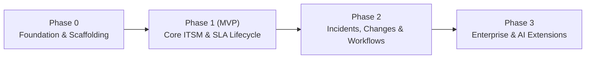

# OpsDesk — Implementation Plan

| Field | Value |
|---|---|
| Document | Implementation Plan & Engineering Roadmap |
| Version | 1.0 |
| Status | Ready for execution |
| Architecture | Monorepo (pnpm + Turborepo), Next.js 15, NestJS 11, Prisma 6, PostgreSQL 16, Redis 7 / BullMQ |
| Related | [PRD](./01-PRD.md) · [TRD](./02-TRD.md) · [UI/UX](./03-UI-UX-Design.md) · [App Flow](./04-App-Flow.md) · [Backend Schema](./05-Backend-Schema.md) |

---

## 1. Executive Summary & Strategy

The OpsDesk implementation follows a **contract-first, domain-centric, phased delivery strategy**. The application transitions from foundation to full operational capability through four distinct phases:



- **Phase 0: Workspace Foundation & Core Tooling** — Monorepo setup, shared contract package, Prisma schema setup, local Docker services, database extensions, and baseline seeding.
- **Phase 1: MVP Core IT Service Desk** — Complete operational loop: Auth, RBAC, Users/Org, Tickets (state machine, assignment, comments, attachments), SLA engine (business hours, timers, background evaluator), Asset tracking, Notifications, and Role-specific Dashboards.
- **Phase 2: Operational Maturity** — Major Incidents (timeline, ticket bundling, postmortems), Change Management (risk matrix, multi-stage approvals), Employee Onboarding/Offboarding workflows, Knowledge Base, and Operational Reporting.
- **Phase 3: Enterprise Extensions** — SSO/MFA, email ingestion, custom workflows, and asynchronous AI classification hooks.

Every feature adheres to the **Ponytail Principle** (laziest minimal solution that actually works, zero unrequested abstractions) and the **ECC Verification Protocol** (typecheck → lint → test → security audit → browser a11y pass).

---

## 2. Phase 0: Workspace Foundation & Tooling (Sprint 0)

### Objectives
Establish the repository structure, code contracts, database containers, and automated quality tooling so all subsequent features can be built on typed primitives.

### Deliverables & Task Breakdown

| Task ID | Component | Task Description | Acceptance Criteria |
|---|---|---|---|
| `P0-1` | Monorepo Setup | Initialize pnpm workspace and Turborepo (`apps/web`, `apps/api`, `packages/contracts`, `packages/config`). | `pnpm build` executes across all packages without error. |
| `P0-2` | Shared Contracts | Build `packages/contracts` with Zod schemas for Auth, Users, Tickets, Assets, SLA, Enums, and Error Responses. | TypeScript types exported and importable in both `web` and `api`. |
| `P0-3` | Local Infrastructure | Configure `docker-compose.yml` for PostgreSQL 16 (with `pg_trgm`, `citext`, `btree_gist`), Redis 7, and Mailpit. | `docker compose up -d` starts healthy DB, Redis, and Mailpit instances. |
| `P0-4` | Prisma Schema & Migrations | Initialize Prisma in `apps/api/prisma`, apply initial migration with sequences, raw SQL constraints, and partial indexes. | Database migrates cleanly; partial unique indexes and triggers verified. |
| `P0-5` | Seed Data Foundation | Build `prisma/seed.ts` providing standard roles, permissions, departments, teams, admin/manager/agent/employee users, default calendar, and SLA policies. | `pnpm db:seed` runs idempotently and populates reference data. |
| `P0-6` | API Baseline Shell | Bootstrap NestJS application with `nestjs-zod`, `GlobalExceptionFilter`, `RequestIdMiddleware`, Helmet, CORS, and Pino logging. | `GET /api/v1/health` returns `200 { status: "ok" }`. |
| `P0-7` | Web Baseline Shell | Bootstrap Next.js 15 (App Router) with Tailwind CSS, shadcn/ui primitives, Inter & JetBrains Mono fonts, and TanStack Query client. | Web boots cleanly at `localhost:3000` with design tokens wired. |

---

## 3. Phase 1: MVP Implementation Plan (Sprints 1–7)

---

### Sprint 1.1: Authentication, Users & Access Control (AUTH, USR, ORG, RBAC)

**Requirements Addressed:** `AUTH-1` through `AUTH-6`, `USR-1` through `USR-5`, `ORG-1` through `ORG-3`, `RBAC-1` through `RBAC-4`.

#### Backend Tasks
1. **Security & Cryptography:** Implement argon2id password hashing helper (`apps/api/src/common/crypto`).
2. **Session & Token Management:**
   - JWT access token generation (15 min expiry, HttpOnly cookie).
   - Opaque refresh token generation with SHA-256 hash storage in `Session` table (7 day expiry, rotation on use, reuse family revocation).
3. **Auth Module Endpoints:**
   - `POST /auth/login` (rate-limited, audit log integration).
   - `POST /auth/logout` (revokes session cookie and DB session row).
   - `POST /auth/refresh` (cookie-based rotation).
   - `POST /auth/password/forgot` and `POST /auth/password/reset` (single-use token, 30m expiry).
   - `POST /auth/invitations/accept` (sets password, sets status `ACTIVE`).
   - `GET /auth/me` (returns user profile, roles, permissions, and teams).
4. **Guards & Interceptors:**
   - `JwtAuthGuard` reading secure cookies.
   - `PermissionsGuard` checking `@RequirePermissions('...')` decorator.
   - `AsyncLocalStorage` request context capturing actor ID, IP, and Request ID.
5. **Users & Org Module:**
   - User CRUD & status management (`POST /users` invitation, `POST /users/:id/status`).
   - Department & Team management with membership binding (`PUT /teams/:id/members`).
   - `AuditService` integration recording all login and permission modifications.

#### Frontend Tasks
1. **Auth Pages:** Build `/login`, `/forgot-password`, `/reset-password`, and `/accept-invite` using React Hook Form + Zod.
2. **Session Management:** Configure Next.js `middleware.ts` for route protection; build `AuthProvider` and `useAuth()` hook.
3. **Access Control Utility:** Implement client-side `can(permission)` helper and `<PermissionGate>` component.
4. **Admin User Management:** Build `/users` data table with filters, search, and user invite drawer.

---

### Sprint 1.2: Ticket Engine & Domain State Machine (TKT, CAT)

**Requirements Addressed:** `TKT-1` through `TKT-8`, `TKT-11`, `TKT-14`.

#### Backend Tasks
1. **Sequence & Keys:** PostgreSQL sequence `ticket_key_seq` generating human keys `TKT-000001`.
2. **Domain State Machine (`TicketsModule/domain`):**
   - Pure state transition validator (`canTransition(from, to)`).
   - Enforce lifecycle: `NEW → TRIAGED → ASSIGNED → IN_PROGRESS ⇄ WAITING_FOR_USER`, etc.
3. **Optimistic Locking:** Enforce version-checking updates on the `Ticket` table (`version Int`). Throw `409 CONFLICT_STALE_VERSION` on mismatch.
4. **Use Case Services:**
   - `createTicket`: Transaction inserting ticket, generating key, auto-routing team via category, logging `TicketEvent(CREATED)`, and emitting outbox event.
   - `transitionTicket`: Transaction validating state machine, setting timestamps, creating `TicketEvent`, and writing audit record.
   - `assignTicket`: Transaction validating agent membership in target team, setting assignee, and recording history.
5. **Controllers & Endpoints:**
   - `GET /tickets` (scoped listing with filtering by status, priority, team, assignee, requester).
   - `POST /tickets` (creation with idempotency header support).
   - `GET /tickets/:id` (detailed view with `allowed-transitions` calculation).
   - `POST /tickets/:id/transitions` (explicit action endpoint).
   - `POST /tickets/:id/assignment` (team and agent assignment).
   - `GET /categories` (hierarchical category tree).

#### Frontend Tasks
1. **Ticket List View:** Implement `/tickets` using `DataTable`, filter chips, search input, and responsive pagination.
2. **New Ticket Creation:** Build `/tickets/new` with employee-friendly guided type selection, category hierarchy, and asset linking.
3. **Ticket Detail Shell:** Build `/tickets/[key]` layout featuring header status badge, priority badge, and `TransitionMenu`.
4. **Concurrency Conflict UI:** Build `<ConflictBanner>` to catch 409 errors and offer safe reload without form loss.

---

### Sprint 1.3: SLA Engine & Background Jobs (SLA, JOBS)

**Requirements Addressed:** `SLA-1` through `SLA-8`, `PRD §26`.

#### Backend Tasks
1. **Domain Business Hours Calculator:**
   - Implement pure functions `addBusinessMinutes(start, minutes, calendar)` and `businessMinutesBetween(a, b, calendar)` in `SlaModule/domain`.
   - Comprehensive unit tests covering weekends, non-work hours, bank holidays, and timezone daylight saving shifts.
2. **SLA Policy Selector:** Deterministic selection based on priority, ticket type, and category match scoring.
3. **Timer Management:**
   - `startTimers`: Computes `RESPONSE` and `RESOLUTION` timers with precomputed `warnAt`, `escalateAt`, `dueAt`.
   - `pauseTimer`: Triggered on `WAITING_FOR_USER`.
   - `resumeTimer`: Calculates paused minutes, shifts `dueAt`, and recalculates thresholds.
   - `completeTimer`: Triggered on first response / ticket resolution.
4. **Background Evaluator Worker (`worker.ts`):**
   - BullMQ repeatable job `sla.evaluate` running every 60 seconds.
   - Scans indexed threshold columns (`warnAt`, `escalateAt`, `dueAt`) for unflagged timers.
   - Updates timers atomically, writes `SlaEvent`, and emits domain events (`sla.warning`, `sla.breached`).
5. **Endpoints:**
   - `GET /sla-policies`, `POST /sla-policies`, `POST /sla-policies/preview`.
   - `GET /tickets/:id/sla` (live timers and audit events).

#### Frontend Tasks
1. **SLA Timer Component:** Build `<SlaTimer>` showing visual progress bar, remaining/overdue countdown, and semantic colors (`ON_TRACK`, `AT_RISK`, `BREACHED`, `PAUSED`).
2. **Ticket Detail Integration:** Embed response and resolution SLA timers prominently in the ticket detail header.
3. **Admin SLA Policy Editor:** Build policy manager with live preview calculator.

---

### Sprint 1.4: Collaboration, Internal Notes & Attachments (TKT, COM, ATT)

**Requirements Addressed:** `TKT-9`, `TKT-10`, `TKT-12`, `TKT-13`, `TKT-18`.

#### Backend Tasks
1. **Comments Module:**
   - Store comments with `PUBLIC` vs `INTERNAL` visibility.
   - Enforce query-level filtering: users without `ticket:view_internal` never receive internal notes.
   - First public agent reply automatically captures `firstResponseAt` and completes the `RESPONSE` SLA timer.
   - Requester reply to ticket in `WAITING_FOR_USER` automatically resumes ticket to `IN_PROGRESS`.
2. **File Storage & Security Service:**
   - Generic `StorageService` interface; implement local filesystem driver for development.
   - Multipart upload pipe validating max 10MB, max 10 attachments per ticket.
   - Magic-byte sniffing via `file-type` against strict MIME allow-list. Disallow SVGs and executables.
   - Generate UUID storage keys; store sanitized original filename.
3. **Authorized Download Endpoint:**
   - `GET /attachments/:id/download` validating ticket access and internal permissions before streaming with `Content-Disposition: attachment` and `X-Content-Type-Options: nosniff`.
4. **Resolution & Reopen Logic:**
   - Resolving requires `resolutionCodeId` and `resolutionSummary`.
   - Reopen allowable only within configured window (`reopen_window_days`). Auto-close cron job closes resolved tickets past window.

#### Frontend Tasks
1. **Comment Composer:** Build `<CommentComposer>` with distinct tabs for **Public Reply** and **Internal Note** (visual amber alert styling).
2. **Attachment Dropzone:** Implement drag-and-drop `<FileDropzone>` with progress indicators and error messages.
3. **Ticket Activity Timeline:** Render chronological timeline unifying comments, system events, and internal notes.
4. **Resolution Modal:** Build `<ResolveTicketDialog>` prompting for resolution code and summary.

---

### Sprint 1.5: Asset Management & Hardware Lifecycle (AST)

**Requirements Addressed:** `AST-1` through `AST-9`, `TKT-15`.

#### Backend Tasks
1. **Asset Type & Sequence:** Tag generator `LAP-000421`, `MON-000112` per asset type prefix.
2. **Asset State Machine:** Enforce transitions: `PROCURED → IN_STOCK ⇄ ASSIGNED`, `IN_REPAIR`, `LOST`, `RETIRED`, `DISPOSED`.
3. **Transactional Assignment:**
   - Atomic transaction: close current assignment (set `returnedAt`) + create new assignment + update asset status and current assignee + log history and audit.
   - Enforce single active assignment via database partial unique index.
   - Prevent assigning retired, lost, or disposed assets.
4. **Asset-Ticket Relationship:**
   - Link ticket to asset; query related tickets on asset detail.
5. **Endpoints:**
   - `GET /assets` (with filters for status, type, department, warranty status).
   - `POST /assets`, `PATCH /assets/:id`.
   - `POST /assets/:id/assign`, `POST /assets/:id/unassign`, `POST /assets/:id/transitions`.
   - `GET /assets/:id/history`, `GET /users/me/assets`.

#### Frontend Tasks
1. **Asset Register:** Build `/assets` table view with warranty badges (Active, Expiring Soon, Expired).
2. **Asset Detail View:** Build `/assets/[tag]` displaying hardware specifications, assignment card, repair history, and linked tickets.
3. **Assignment Dialog:** Build user selection modal with active-status checks and assignment notes.
4. **Employee "My Assets" Page:** Build `/my/assets` giving employees instant visibility of company property in their possession.

---

### Sprint 1.6: Notifications, Search & Dashboards (NTF, DSH, SRCH, AUD)

**Requirements Addressed:** `NTF-1` through `NTF-3`, `DSH-1` through `DSH-3`, `SRCH-1` through `SRCH-5`, `AUD-1` through `AUD-4`.

#### Backend Tasks
1. **Transactional Outbox Dispatcher:**
   - Polling job every 2 seconds reading `OutboxEvent` with `FOR UPDATE SKIP LOCKED`.
   - Dispatches events to BullMQ queues.
2. **Notification Worker:**
   - Consumes domain events, resolves recipients according to business rules, generates in-app `Notification` rows.
3. **Global Search Engine:**
   - Optimized PostgreSQL query utilizing `search_vector` GIN indexes on tickets and `pg_trgm` indexes on assets and users.
   - Scopes results to actor permissions.
4. **Role-Aware Dashboard Aggregates:**
   - `GET /dashboard/employee` (my open tickets, awaiting response, assigned assets).
   - `GET /dashboard/agent` (assigned tickets, unassigned team queue, SLA at risk/breached).
   - `GET /dashboard/manager` (workload by team, SLA compliance %, resolution averages).
5. **Audit Log API:**
   - `GET /audit-logs` with actor, action, entity, and date range filters for authorized administrators.

#### Frontend Tasks
1. **Top Navigation & Global Search:** Implement ⌘K modal searching tickets, assets, and users.
2. **Notification Center:** Notification bell icon with unread badge count, dropdown list, and `/notifications` manager.
3. **Role-Specific Dashboards:**
   - Employee Dashboard with quick-action cards.
   - Agent Dashboard prioritizing breached and at-risk queues.
   - Manager Dashboard with operational stat cards and team workload breakdowns.
4. **Audit Log Viewer:** Read-only table displaying diffs between old and new state.

---

### Sprint 1.7: MVP Hardening, Testing & Verification Gate

#### Tasks
1. **E2E Playwright Suite:** Implement and verify scenarios `E2E-1` through `E2E-9` (covering ticket lifecycle, SLA pause/resume, RBAC boundary, asset reassignment, and concurrency).
2. **Automated Accessibility Audit:** Run `@axe-core/playwright` across all primary pages. Fix all contrast, label, and keyboard focus findings.
3. **Security Scan:** Run ECC `security-scan` and dependency audit. Verify rate-limiting on sensitive endpoints.
4. **MVP Codebase Review:** Run `ponytail-review` to eliminate dead abstractions and verify DRY standard library usage.

---

## 4. Phase 2: Operational Maturity Implementation Plan (Sprints 8–12)

---

### Sprint 2.1: Incident Management & Service Topology (INC)

**Requirements Addressed:** `INC-1` through `INC-6`.

1. **Services Register:** Manage IT service catalog (VPN, Email, IdP, Office Network).
2. **Incident Lifecycle & Timeline:**
   - Severity levels (`SEV1`–`SEV4`), state machine (`IDENTIFIED → INVESTIGATING → MITIGATING → MONITORING → RESOLVED → CLOSED`).
   - Append-only incident timeline with manual notes and automated lifecycle markers.
3. **Parent-Child Ticket Bundling:**
   - Link multiple incident tickets to a major incident.
   - Bulk communication: update all linked ticket requesters in one action.
4. **Postmortem System:**
   - Postmortem document creation (Summary, Root Cause, Timeline, Corrective/Preventive actions).
   - Mandate published postmortem prior to closing SEV1/SEV2 incidents.

---

### Sprint 2.2: Change Management & Multi-Level Approvals (CHG)

**Requirements Addressed:** `CHG-1` through `CHG-6`.

1. **Change Requests Engine:**
   - Types (`STANDARD`, `NORMAL`, `EMERGENCY`), Risk rating (`LOW` to `CRITICAL`).
   - Implementation plan, validation plan, and rollback plan capture.
2. **Configurable Approval Matrix:**
   - Match rules by Type × Risk to determine required approval counts.
   - Append-only `ChangeApproval` decisions (`APPROVED`, `REJECTED`, `REQUEST_CHANGES`).
   - Guard against self-approval (requester cannot approve own change).
3. **Execution & Schedule Guard:**
   - Change window calendar view; prevent moving to `IMPLEMENTING` before start window.
   - Service conflict detector for overlapping maintenance windows.

---

### Sprint 2.3: Employee Onboarding & Offboarding Workflows (WF)

**Requirements Addressed:** `WF-1` through `WF-6`.

1. **Workflow Request Engine:** Onboarding and Offboarding requests instantiated from configurable department templates.
2. **Checklist Task System:**
   - Generated tasks assigned to specific teams (Hardware provisioning, Identity creation, VPN access).
   - Task states: `PENDING → IN_PROGRESS → COMPLETED / BLOCKED / SKIPPED`.
3. **Offboarding & Asset Recovery Coupling:**
   - Offboarding automatically inspects employee's active assets and creates recovery tasks.
   - Completing a recovery task triggers asset return to `IN_STOCK`.
   - Completion of all required tasks triggers user account deactivation (`DISABLED`).

---

### Sprint 2.4: Knowledge Base & Auto-Suggestions (KB)

**Requirements Addressed:** `KB-1` through `KB-4`.

1. **Article Lifecycle:** `DRAFT → REVIEW → PUBLISHED → ARCHIVED`.
2. **Markdown Editor & Reader:** Clean reader with table of contents and sanitized HTML rendering.
3. **Contextual Help on Ticket Creation:**
   - As an employee types a ticket title and selects a category, query `GET /kb/suggest` and display matching articles to deflect tickets.
4. **Ticket Attachment:** Support agents attach KB articles directly to support replies.

---

### Sprint 2.5: Reporting & Operational Analytics (RPT)

**Requirements Addressed:** `RPT-1` through `RPT-3`.

1. **Daily Aggregate Rollup:** Nightly job precalculating `DailyTicketStats` (created, resolved, breaches, response times by team).
2. **Management Reports:**
   - Ticket volume trends, category distribution, SLA compliance % by team, and breach breakdown.
   - Date range selector (Last 7d, 30d, 90d, Custom).
3. **Export Engine:** Stream CSV exports for all operational data tables.

---

## 5. Phase 3: Future Enterprise & AI Extensions (Post-v1.0)

| Extension | Functional Objective | Architecture Preparation in v1 |
|---|---|---|
| **SSO / SAML 2.0** | Enterprise IdP login (Okta, Google Workspace, Azure AD) | `User` schema already includes `email` uniquely, identity decouple ready |
| **MFA (TOTP / WebAuthn)** | Second-factor authentication for agents and admins | Session model supports two-factor challenge states |
| **Email-to-Ticket Ingestion** | IMAP/POP3 poller parsing inbound emails into tickets | Ticket creation service accepts `createdById` and raw message body |
| **Webhook Integrations** | Webhooks dispatched on ticket/incident/change events | `OutboxEvent` table ready as webhook delivery source |
| **AI Ticket Classification** | Auto-categorization and priority suggestion | Standardized category taxonomy and clean description fields |
| **AI Incident Summarizer** | Generate postmortem drafts from incident timeline | Structured timeline events already logged chronologically |

---

## 6. Testing Strategy & Traceability Matrix

### 6.1 Testing Pyramid

```text
       ▲
      / \     E2E Tests (Playwright: 12 key cross-role journeys)
     /   \
    /     \    Integration Tests (NestJS + Supertest + Testcontainers DB)
   /       \
  /_________\  Unit Tests (Pure domain state machines, SLA math, Zod schemas)
```

### 6.2 Requirements Traceability Matrix

| Requirement Group | Primary Unit Test Focus | Primary Integration Test Focus | E2E Scenario |
|---|---|---|---|
| **Auth & RBAC** | Password policy, Token hash, Permission evaluator | Login rate limiting, cookie set/refresh, 401/403 guards | `E2E-9` |
| **Ticket Lifecycle** | State machine transitions, Version increment | `POST /tickets`, valid/invalid transitions, 409 concurrency | `E2E-1`, `E2E-4` |
| **SLA Engine** | Business hours math, calendar shifts, holiday skips | Recalculation on priority change, evaluator job threshold crossing | `E2E-2`, `E2E-5` |
| **Comments & Uploads** | Magic-byte sniffing, filename sanitization | Visibility filtering (internal notes), secure file streaming | `E2E-3`, `E2E-7` |
| **Asset Tracking** | Asset state machine, single active assignment guard | DB trigger blocking assignment to retired asset, reassign flow | `E2E-6` |
| **Incidents (P2)** | Incident lifecycle rules, postmortem completeness | Linking tickets, notifying requesters, timeline append | `E2E-11` |
| **Changes (P2)** | Approval rule threshold evaluation, self-approval block | Multi-manager approval progression, implementation window check | `E2E-10` |
| **Workflows (P2)** | Task completion rule, skip validation | Offboarding task completion unassigning hardware & disabling user | `E2E-12` |

---

## 7. Quality Gates & Definition of Done

### 7.1 Verification Loop (`pnpm verify`)
Before any feature branch or task is deemed complete, the engineer or agent must run the verification pipeline:
1. **Typecheck:** `pnpm typecheck` (zero TypeScript errors with `strict: true`).
2. **Lint:** `pnpm lint` (ESLint and Prettier rules pass).
3. **Unit Tests:** `pnpm test:unit` (100% passing; ≥90% line coverage on `domain/`).
4. **Integration Tests:** `pnpm test:integration` (API contract and DB trigger tests pass).
5. **Diff Review:** Inspect git diff ensuring no unneeded files, console logs, or leaked secrets.

### 7.2 Ponytail Code Quality Audit
- Is this the simplest code that solves the problem?
- Did we avoid adding unnecessary dependencies or premature abstractions?
- Is bug fixing addressing the root cause rather than patching symptoms?
- Are deliberate shortcuts documented with `// ponytail: [rationale]`?

### 7.3 Feature Definition of Done
A feature is complete **only** when all the following items are verified:
- [x] Database migration and Prisma model written and tested.
- [x] Zod contracts defined in `packages/contracts` and shared with frontend.
- [x] Backend service, state machine, and authorization policy implemented.
- [x] Thin controller with proper HTTP status codes and error responses.
- [x] Frontend form and data presentation components built with accessible Radix primitives.
- [x] Optimistic locking (`version`) and concurrency handling wired.
- [x] History event and audit log rows generated in the same transaction.
- [x] Outbox event emitted for asynchronous side effects (notifications/SLA).
- [x] Unit and integration tests passing.

---

## 8. Risk Management & Mitigations

| Risk | Impact | Probability | Mitigation Strategy |
|---|---|---|---|
| **SLA Timezone / DST calculation errors** | High | Medium | Pure calculator isolated in domain layer; test suite with 40+ parameterized test cases covering DST transitions, holidays, and 24x7 vs business hour boundaries. |
| **Permission Sprawl & Leaks** | Critical | Low | Two-stage check: coarse `@RequirePermissions` decorator + fine-grained policy class; integration tests asserting 403/404 for all roles against every endpoint. |
| **Concurrent Record Overwrites** | Medium | Medium | Strict optimistic concurrency (`version` column) returning 409; automated Playwright test simulating two agents editing the same ticket. |
| **File Upload Vulnerabilities** | Critical | Low | Magic byte content sniffing (disallow SVG/HTML), random UUID storage paths, private storage directory, streaming downloads with forced attachment header. |
| **Scope Bloat before MVP** | High | Medium | Strict phase boundary: Phase 1 MVP delivered and stabilized before any Phase 2 code is written. |

---

## 9. Execution Schedule & Milestones

```text
Week 1: Phase 0 (Foundation) + Sprint 1.1 (Auth, Users, Org, RBAC)
Week 2: Sprint 1.2 (Ticket Lifecycle & State Machine) + Sprint 1.3 (SLA Engine & Calculator)
Week 3: Sprint 1.4 (Comments, Internal Notes, Attachments) + Sprint 1.5 (Asset Management)
Week 4: Sprint 1.6 (Notifications, Dashboards, Search) + Sprint 1.7 (MVP Testing, a11y, Hardening)
── MILESTONE 1: OPSDESK MVP RELEASE ──
Week 5: Sprint 2.1 (Incidents & Services) + Sprint 2.2 (Change Management & Approvals)
Week 6: Sprint 2.3 (Onboarding/Offboarding) + Sprint 2.4 (Knowledge Base)
Week 7: Sprint 2.5 (Reports & Analytics) + Phase 2 Polish & Documentation
── MILESTONE 2: OPSDESK V1.0 PRODUCTION RELEASE ──
```
